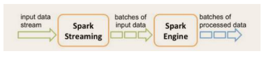
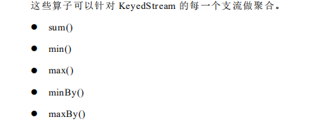
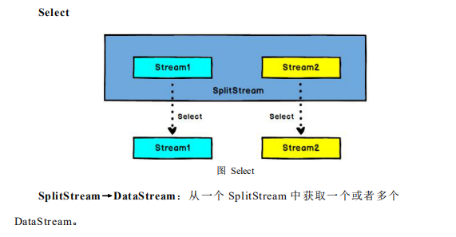
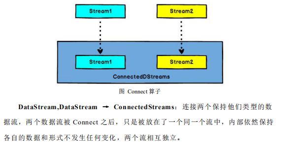
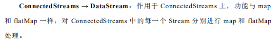
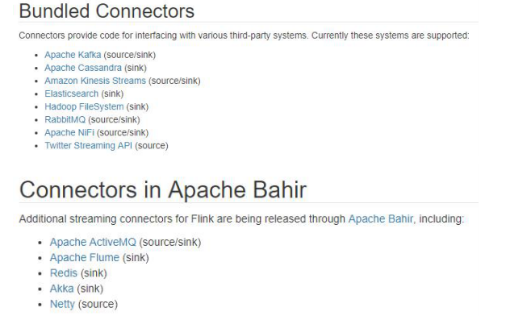

### 一、Flink简介

#### 1)  初识Flink 

Flink 起源于 Stratosphere 项目，Stratosphere 是在 2010~2014 年由 3 所地处柏林
的大学和欧洲的一些其他的大学共同进行的研究项目，2014 年 4 月 Stratosphere 的
代 码 被 复 制 并 捐 赠 给 了 Apache 软 件 基 金 会 ， 参 加 这 个 孵 化 项 目 的 初 始 成 员 是
Stratosphere 系统的核心开发人员，2014 年 12 月，Flink 一跃成为 Apache 软件基金
会的顶级项目。
在德语中，Flink 一词表示快速和灵巧，项目采用一只松鼠的彩色图案作为 logo，
这不仅是因为松鼠具有快速和灵巧的特点，还因为柏林的松鼠有一种迷人的红棕色，
而 Flink 的松鼠 logo 拥有可爱的尾巴，尾巴的颜色与 Apache 软件基金会的 logo 颜
色相呼应，也就是说，这是一只 Apache 风格的松鼠。

Flink 项目的理念是：“**Apache Flink 是为分布式、高性能、随时可用以及准确
的流处理应用程序打造的开源流处理框架**”。
Apache Flink 是一个框架和分布式处理引擎，用于对无界和有界数据流进行有
状态计算。Flink 被设计在所有常见的集群环境中运行，以内存执行速度和任意规模
来执行计算。

#### 2) Flink的重要特点

* 事件驱动型 Event-driver

  事件驱动型应用是一类具有状态的应用，它从一个或多个事件流提取数据，并根据到来的事件触发计算、状态更新或其他外部动作。比较典型的就是以kafka为代表的消息队列几乎都是事件驱动型应用。

  与之不同的就是sparkStreaming微批次，如图：

  

  事件驱动型：

  

* 流与批的世界观

  **批处理**的特点是有界、持久、大量，非常适合需要访问全套记录才能完成的计算工作，一般用于离线统计。

  **流处理**的特点是无界、实时，无需针对整个数据集执行操作，而是对通过系统的传输的每个数据项执行操作，一般用于实时统计。

  在spark的世界观中，一切都是由批次组成的，离线数据是一个大批次，而实时数据是由一个一个无限小的小批次组成的。

  在Flink的世界观中，一切都是由流组成的，离线数据是有限的流，实时数据是一个没有界限的流，这就是所谓的有界流和无界流。

  无界数据流：无界数据流有一个开始但是没有结束，它们不会在生成时终止并
  提供数据，必须连续处理无界流，也就是说必须在获取后立即处理 event。对于无界
  数据流我们无法等待所有数据都到达，因为输入是无界的，并且在任何时间点都不
  会完成。处理无界数据通常要求以特定顺序（例如事件发生的顺序）获取 event，以
  便能够推断结果完整性。
  有界数据流：有界数据流有明确定义的开始和结束，可以在执行任何计算之前
  通过获取所有数据来处理有界流，处理有界流不需要有序获取，因为可以始终对有
  界数据集进行排序，有界流的处理也称为批处理。

  

* 分层api

  

**快速上手**

~~~scala
object StreamWordCount{
  def main(args: Array[String]): Unit = {
    val params: ParameterTool = ParameterTool.fromArgs(args)
    val host: String = params.get("host")
    val port: Int = params.getInt("port")

    //创建流出具环境
    val env: StreamExecutionEnvironment = StreamExecutionEnvironment.getExecutionEnvironment
    //接收socket文本流
    val textDS: DataStream[String] = env.socketTextStream(host, port)
    val dataStream: DataStream[(String, Int)] = textDS.flatMap(_.split("\\s")).filter(_.nonEmpty).map((_, 1)).keyBy(0).sum(1)
    dataStream.print.setParallelism(1)
    env.execute("socket stream word count")

  }
}

object WordCount {
  def main(args: Array[String]): Unit = {
    //创建执行环境
    val env: ExecutionEnvironment = ExecutionEnvironment.getExecutionEnvironment

    //从文件中读取数据
    val inputPath = "data/hello.txt"
    val inputDS: DataSet[String] = env.readTextFile(inputPath)

    //分词之后，对单词进行groupBy分组，然后进行sum聚合
    val wordCountDS = inputDS.flatMap(_.split(" "))
      .map((_, 1))
      .groupBy(0)
      .sum(1)
    wordCountDS.print()

//    env.execute(" word count")
  }
~~~

### 二、Flink运行架构

#### 1）运行架构

Flink运行时架构只要包含四个不同的组件，他们会在流处理应用程序协同工作：

作业管理器（JobMananger）

资源管理器（ResouceManager）

任务管理器（TaskManager）

分发器（dispatcher）

因为Flink是用Java和scala实现的，所以所有的组件都会运行在JVM上，每个组件职责如下：

* 作业管理器（JobMananger）

  控制一个app执行的主进程，也就说，每个应用程序都会被一个不同的JM所控制执行，JM会先接收到要执行的应用程序，这个应用程序会包括：

  * 作业图（JobGraph）
  * 逻辑数据流程图（logical dataflow graph）

  * 打包了所有的类、库
  * 其他资源的jar包

  JM会把JobGraph转换成一个物层面的数据流图，这个图会被叫做“执行图”，包含了所有可以并发执行的任务。JM会向资源管理器请求执行任务的相关资源，也就是TM上的slot,一旦他获取到足够的资源，就会执行图发到真正运行他们的TM上，而运行的过程，JM会负责所以需要的中央协调操作，比如检查点的协调。

* 资源管理器（ResourceManager）

  主要负责管理任务管理器的插槽（slot）， TaskManager插槽是Flink中定义的处理资源单元。Flink为不同的环境和资源管理工具提供了不同的资源管理器，比如：yarn/mesos/k8s,以及standalone部署。

  当JM申请插槽资源的时候，RM会有空闲的插槽的TM会分配个给JM。如果RM没有足够的插槽来满足JM的请求，他还可以向资源提供平台发起会话，以提供启动TM的进程容器。另外，RM还负责终止空闲的TaskManager，释放计算资源。

* 任务管理器（TaskManager）

  Flink 中的工作进程，通常在Flink中会有多个TaskManager运行。每个TM都包含了一定数量的slot,slot的数量限制了TM能执行任务的数量。

  启动之后，TM会向资源管理器注册他的插槽，收到资源指令后，taskmanager将一个或者多个插槽提供给JM调用。JM就可以向插槽分配任务来执行。在执行功过程中，一个TM可以运行同一个应用程序的TM交换数据。

* 分发器（Dispatcher）

  可以跨作业执行，它为应用提供了Rest接口，当一个应用被提交执行时，分发器就会启动并将会将应用提交给jobmanager，由于REST接口，所以dispatcher可以作为集群的一个http接入点，这样就能够不不受防火墙阻挡。dispatcher也会启动一个webUI ，用来方便地展示和将空作业执行的信息。

  Dispatcher在架构中可能不是必须的，这也取决应用的提交运行方式。
  
  

#### 2）任务提交流程

> Flink的各个组件如何交互协作。

上图是从一个较为高层级的视角，来看应用中各组件的交互协作。如果部署的集群环境
不同（例如 YARN，Mesos，Kubernetes，standalone 等），其中一些步骤可以被省略，或是
有些组件会运行在同一个 JVM 进程中。

> Flink 集群部署到YARN上，提交流程

Flink 任 务 提 交 后 ， Client 向 HDFS 上 传 Flink 的 Jar 包 和 配 置 ， 之 后 向 Yarn
ResourceManager 提 交 任 务 ， ResourceManager 分 配 Container 资 源 并 通 知 对 应 的
NodeManager 启动 ApplicationMaster，ApplicationMaster 启动后加载 Flink 的 Jar 包
和配置构建环境，然后启动 JobManager，之后 ApplicationMaster 向 ResourceManager
申 请 资 源 启 动 TaskManager ， ResourceManager 分 配 Container 资 源 后 ， 由
ApplicationMaster 通 知 资 源 所 在 节 点 的 NodeManager 启 动 TaskManager ，
NodeManager 加载 Flink 的 Jar 包和配置构建环境并启动 TaskManager，TaskManager
启动后向 JobManager 发送心跳包，并等待 JobManager 向其分配任务。

#### 3）任务调度原理

* TaskManager 与 slots
* 程序与数据流 DataFlow
* 执行图 executionGraph
* 并行度 Parallelism
* 任务链 operator Chains

### 三、Flink 流处理API

#### 1) Environment

* getExexutionEnvironment
* createLocalEnvironment
* createRemoteEnvironment

* Source

  ~~~scala
  /**
   * @author : Rison 2021/7/6 下午5:50
   *         不同的方法读取数据
   */
  object OriginDataType {
  
    private val env: StreamExecutionEnvironment = StreamExecutionEnvironment.getExecutionEnvironment
    //从集合读取数据
    private val dataStream1: DataStream[SensorReading] = env.fromCollection(
      List(
        SensorReading("sensor_1", 1547718199, 35.8),
        SensorReading("sensor_6", 1547718201, 15.4),
        SensorReading("sensor_7", 1547718202, 6.7),
        SensorReading("sensor_10", 1547718205, 38.1)
      )
    )
  
    //从文件读取数据
    private val dataStream2: DataStream[String] = env.readTextFile("/data")
  
    //从kafka读取数据
    /**
     * 引入jar
     * <dependency>
     * <groupId>org.apache.flink</groupId>
     * <artifactId>flink-connector-kafka-0.11_2.12</artifactId>
     * <version>1.10.1</version>
     * </dependency>
     */
  
    private val properties = new Properties()
    properties.setProperty("bootstrap.servers", "localhost:9020")
    properties.setProperty("group.id", "consumer_group")
    properties.setProperty("key.deserializer", "org.apache.kafka.common.serialization.StringDeserializer")
    properties.setProperty("value.deserializer", "org.apache.kafka.common.serialization.StringDeserializer")
    properties.setProperty("auto.offset.reset", "latest")
    private val dataStream3: DataStream[String] = env.addSource(
      new FlinkKafkaConsumer011[String]("sensor", new SimpleStringSchema(), properties)
    )
  
    //自定义source
    private val dataStream4: DataStream[SensorReading] = env.addSource(
      MySenSorSource()
    )
  
  
  }
  
  case class SensorReading(id: String, timestamp: Long, temperature: Double)
  
  case class MySenSorSource() extends SourceFunction[SensorReading] {
    // flag：表示数据源是否还在正常运行
    var running: Boolean = true
  
    override def run(sourceContext: SourceFunction.SourceContext[SensorReading]): Unit = {
      //初始话一个随机数发生器
      val random = new Random()
      var tuples = 1.to(10).map(
        i => {
          ("sensor_" + i, 65 + random.nextGaussian() * 20)
        }
      )
  
      while (running) {
        //更新温度值
        tuples = tuples.map(
          t => (t._1, t._2 + random.nextGaussian())
        )
  
        //当前时间
        val curTime = System.currentTimeMillis()
  
        tuples.foreach(
          t => sourceContext.collect(SensorReading(t._1, curTime, t._2))
        )
        Thread.sleep(100)
      }
    }
  
    override def cancel(): Unit = {
      running = false
    }
  }
  
  ~~~

  

#### 2)   Transform 转换算子

* map

* flatMap

  

* Filter

  

* keyBy

  

* 滚动聚合算子 Rolling Aggregation

  

* Reduce

  

* Split 和 Select

  

  

* Connect 和 CoMap

  

  

  

* Union

  

~~~scala
/**
 * @author : Rison 2021/7/6 下午6:27
 *         转换算子
 */
object TransFormFunction {
  def main(args: Array[String]): Unit = {

    val env: StreamExecutionEnvironment = StreamExecutionEnvironment.getExecutionEnvironment

    val dataStream: DataStream[String] = env.readTextFile("data/hello.txt")
    //map
    dataStream.map(
      data => {
        data.toInt * 2
      }
    )

    //flatMap
    /**
     * flatMap 的函数签名：def flatMap[A,B](as: List[A])(f: A ⇒ List[B]): List[B]
     * 例如: flatMap(List(1,2,3))(i ⇒ List(i,i))
     * 结果是 List(1,1,2,2,3,3), 而 List("a b", "c d").flatMap(line ⇒ line.split(" "))
     * 结果是 List(a, b, c, d)。
     */
    dataStream.flatMap(
      data => {
        data.split(" ")
      }
    )

    // Filter
    dataStream.filter(
      data => {
        data.toInt == 1
      }
    )

    //keyBy
    /**
     * DataStream → KeyedStream：逻辑地将一个流拆分成不相交的分区，每个分
     * 区包含具有相同 key 的元素，在内部以 hash 的形式实现的。
     */

    //滚动聚合算子 Rolling Aggregation
    /**
     * 这些算子可以针对 KeyedStream 的每一个支流做聚合。
     *  sum()
     *  min()
     *  max()
     *  minBy()
     *  maxBy()
     */

    // reduce
    /**
     * KeyedStream → DataStream：一个分组数据流的聚合操作，合并当前的元素
     * 和上次聚合的结果，产生一个新的值，返回的流中包含每一次聚合的结果，而不是
     * 只返回最后一次聚合的最终结果
     */

    dataStream.map(
      data => {
        val strings: Array[String] = data.split(",")
        (data(0).toLong, data(1).toInt, data(1).toInt)
      }
    )
      .keyBy(0)
      .reduce(
        (x, y) => {
          (x._1, x._2, x._3 + y._3)
        }
      )

    //Split 和 Select
    /**
     * Split :
     * DataStream → SplitStream：根据某些特征把一个 DataStream 拆分成两个或者
     * 多个 DataStream。
     *
     * Select ：
     * SplitStream→DataStream：从一个 SplitStream 中获取一个或者多个
     * DataStream。
     */

    val splitDataStream: SplitStream[(Long, Int)] = dataStream
      .map(
        data => {
          val strings: Array[String] = data.split(",")
          (strings(0).toLong, strings(1).toInt)
        }
      )
      .split(
        data => {
          if (data._2 > 30) Seq("high") else Seq("low")
        }
      )

    val high: DataStream[(Long, Int)] = splitDataStream.select("high")
    val low: DataStream[(Long, Int)] = splitDataStream.select("low")
    val all: DataStream[(Long, Int)] = splitDataStream.select("high", "low")

    // Connect 和 CoMap

    /**
     * DataStream,DataStream → ConnectedStreams：连接两个保持他们类型的数
     * 据流，两个数据流被 Connect 之后，只是被放在了一个同一个流中，内部依然保持
     * 各自的数据和形式不发生任何变化，两个流相互独立
     *
     * ConnectedStreams → DataStream：作用于 ConnectedStreams 上，功能与 map
     * 和 flatMap 一样，对 ConnectedStreams 中的每一个 Stream 分别进行 map 和 flatMap
     * 处理
     */

    val connectDataStream: ConnectedStreams[(Long, Int), (Long, Int)] = high.connect(low)

    val coMap: DataStream[((Long, Int), String)] = connectDataStream.map(
      highData => (highData, "high"),
      lowData => (lowData, "low")
    )

    //union
    /**
     * DataStream → DataStream：对两个或者两个以上的 DataStream 进行 union 操
     * 作，产生一个包含所有 DataStream 元素的新 DataStream
     *
     * 1． Union 之前两个流的类型必须是一样，Connect 可以不一样，在之后的 coMap
     * 中再去调整成为一样的。
     * 2. Connect 只能操作两个流，Union 可以操作多个
     */
    val union: DataStream[(Long, Int)] = high.union(low)

  }
}

~~~

#### 3) 支持的数据类型

> Flink 流应用程序处理的是以数据对象表示的事件流。所以在 Flink 内部，我们
> 需要能够处理这些对象。它们需要被序列化和反序列化，以便通过网络传送它们；
> 或者从状态后端、检查点和保存点读取它们。为了有效地做到这一点，Flink 需要明
> 确知道应用程序所处理的数据类型。Flink 使用类型信息的概念来表示数据类型，并
> 为每个数据类型生成特定的序列化器、反序列化器和比较器。
> Flink 还具有一个类型提取系统，该系统分析函数的输入和返回类型，以自动获
> 取类型信息，从而获得序列化器和反序列化器。但是，在某些情况下，例如 lambda
> 函数或泛型类型，需要显式地提供类型信息，才能使应用程序正常工作或提高其性
> 能。

* 基础数据类型

  > Flink 支持所有的 Java 和 Scala 基础数据类型，Int, Double, Long, String, …

  ~~~ scala
  val numbers: DataStream[Long] = env.fromElements(1L, 2L, 3L, 4L)
  numbers.map( n => n + 1 )
  ~~~

* Java 和 Scala元组（Tuples）

  ~~~ scala
  val persons: DataStream[(String, Integer)] = env.fromElements(
  ("Adam", 17),
  ("Sarah", 23) )
  persons.filter(p => p._2 > 18)
  ~~~

  

* Scala样例类（case class）

  ~~~scala
  case class Person(name: String, age: Int)
  val persons: DataStream[Person] = env.fromElements(
  Person("Adam", 17),
  Person("Sarah", 23) )
  persons.filter(p => p.age > 18)
  ~~~

  

* Java简单对象（POJO）

  ~~~scala
  public class Person {
  public String name;
  public int age;
  public Person() {}
  public Person(String name, int age) {
  this.name = name;
  this.age = age;
  }
  }
  DataStream<Person> persons = env.fromElements(
  new Person("Alex", 42),
  new Person("Wendy", 23));
  ~~~

  

* 其他（Array,List,Map,Enum,等等）

  > Flink 对 Java 和 Scala 中的一些特殊目的的类型也都是支持的，比如 Java 的
  > ArrayList，HashMap，Enum 等等

  

#### 4) 实现UDF函数----更细粒度的控制流

* 函数类 Function

  Flink 暴露了所有的UDF函数接口（实现方式为接口或者抽象类）。例如MapFunction/FilterFunction/ProcessFunction等等。

  比如 FilterFunction接口：

  ~~~scala
  **
   * @author : Rison 2021/7/6 下午7:32
   *
   */
  class FilterFilter extends FilterFunction[String]{
    override def filter(t: String): Boolean = {
      t.contains("flink")
    }
  }
  
  object FilterMain{
    def main(args: Array[String]): Unit = {
       val env: StreamExecutionEnvironment = StreamExecutionEnvironment.getExecutionEnvironment
  
      val dataStream: DataStream[String] = env.fromCollection(
        List("spark", "flink")
      )
      //外部函数定义
      dataStream.filter(new FilterFilter).print("外部函数：")
  
      //匿名函数
      dataStream.filter(
        new FilterFunction[String] {
          override def filter(t: String) = {
            t.contains("spark")
          }
        }
      ).print("匿名函数：")
  
      //带参判断
  
      dataStream.filter(
        FilterKey("flink")
      ).print("带参数flink:")
  
      env.execute("Filter main")
    }
  }
  
  case class FilterKey(key: String) extends FilterFunction[String]{
    override def filter(t: String): Boolean = {
      t.contains(key)
    }
  }
  ~~~

  

* 匿名函数 lambda Function

  ~~~scala
  
  /**
   * @author : Rison 2021/7/7 上午8:54
   *  lambada Function instance
   */
  object LambdaFunctionMain {
    def main(args: Array[String]): Unit = {
      val env: StreamExecutionEnvironment = StreamExecutionEnvironment.getExecutionEnvironment
      val dataStream: DataStream[String] = env.fromCollection(
        List("flink", "spark")
      )
      dataStream.filter(_.contains("flink")).print("lambda:")
      env.execute("lambda Function")
    }
  }
  ~~~

  

* 富函数 Rich Function

  **富函数**是DataStream API提供的一个函数类的接口，所有Flink函数类都有其Rich版本，她与常规函数的不同在于，可以获取其运行环境的上下文，并拥有一些生命周期方法，所以实现更复杂的功能。

  * RichMapFunction
  * RichFlatMapFunction
  * RichFilterFunction
  * ...

  Rich Function 有一个生命周期的概念，典型的生命周期方法有：

  * open() 是rich function的初始化方法，当一个算子例如map 或者filter被调用之前open()会被调用。

  * close() 是生命周期中的最后调用的方法，做一些清理操作，比如关闭连接等等。

  * getRuntimeContext() 提供了函数的RuntimeContext的一些信息，比如函数要执行的并行度，任务名字，以及state的状态。

    ~~~ scala
    /**
     * @author : Rison 2021/7/7 上午9:07
     *         RichFunction
     *
     */
    object RichFunctionMain {
      def main(args: Array[String]): Unit = {
        val env: StreamExecutionEnvironment = StreamExecutionEnvironment.getExecutionEnvironment
        env.fromCollection(
          List(2, 2, 10, 11, 12, 14, 16, 17, 20)
        ).flatMap(new MyFlatMap).print()
        env.execute("rich function")
    
      }
    }
    
    class MyFlatMap extends RichFlatMapFunction[Int, (Int, Int)] {
      var subTaskIndex = 0
    
      override def open(parameters: Configuration): Unit = {
        subTaskIndex = getRuntimeContext.getIndexOfThisSubtask
        //以下可以做些初始化操作，比如建立hdfs连接等等
      }
    
      override def flatMap(in: Int, collector: Collector[(Int, Int)]): Unit = {
        if (in % 2 == subTaskIndex) {
          collector.collect((subTaskIndex, in))
        }
      }
    
      override def close(): Unit = {
        //做一些关闭清理操作
      }
    }
    
    ~~~

#### 5) Sink

Flink  没有类似于spark的foreach方法，让用户进行迭代操作，虽有对外的输出操作利用Sink完成，最后通过类似如下方式完成整个任务的输出操作：

~~~~ scala
stream.addSink(new MySink(XXXX))
~~~~

官方提供了一部分的框架Sink，除此之外，都要用户自定义实现sink.

* kafka

  * pom.xml

    ~~~ scala
     <dependency>
                <groupId>org.apache.flink</groupId>
                <artifactId>flink-connector-kafka-0.11_2.12</artifactId>
                <version>1.10.1</version>
     </dependency>
    ~~~

    

  * 代码

    ~~~scala
    /**
     * @author : Rison 2021/7/7 上午9:49
     *         kafka Sink
     */
    object KafkaSinkMain {
      def main(args: Array[String]): Unit = {
        val env: StreamExecutionEnvironment = StreamExecutionEnvironment.getExecutionEnvironment
        env.fromCollection(
          List(
            KafkaDemo("kafka_1", "topic_1"),
            KafkaDemo("kafka_2", "topic_2")
          )
        )
          .map(
            data => {
              data.toString
            }
          )
          .addSink(new FlinkKafkaProducer011[String]("localhost:9092", "test", new SimpleStringSchema[KafkaDemo]()))
        env.execute("kafka sink main")
    
      }
    }
    
    case class KafkaDemo(key: String, topic: String)
    ~~~

    

* redis

  * pom.xml

    ~~~ scala
            <dependency>
                <groupId>org.apache.bahir</groupId>
                <artifactId>flink-connector-redis_2.11</artifactId>
                <version>1.0</version>
            </dependency>
    ~~~

    

  * 代码

    ~~~scala
    /**
     * @author : Rison 2021/7/7 上午10:06
     *         Redis Sink
     */
    object RedisSinkMain {
      def main(args: Array[String]): Unit = {
        val env: StreamExecutionEnvironment = StreamExecutionEnvironment.getExecutionEnvironment
        val redisConf: FlinkJedisPoolConfig = new FlinkJedisPoolConfig.Builder()
          .setHost("192.168.1.215")
          .setPort(6379)
          .setPassword("xxxx")
          .setDatabase(12)
          .build()
        env.fromCollection(
          List(
            RedisDemo("key_1", "value_1"),
            RedisDemo("key_2", "value_2")
          )
        ).addSink(new RedisSink[RedisDemo](redisConf, MyRedisMapper()))
        env.addSource(MyRedisSource("redis:sink:instance")).print()
        env.execute("redis sink")
      }
    }
    
    case class RedisDemo(key: String, value: String)
    
    case class MyRedisMapper() extends RedisMapper[RedisDemo] {
      override def getCommandDescription: RedisCommandDescription = {
        new RedisCommandDescription(RedisCommand.HSET, "redis:sink:instance")
      }
    
      override def getKeyFromData(in: RedisDemo): String = {
        in.key
      }
    
      override def getValueFromData(in: RedisDemo): String = {
        in.value
      }
    }
    
    case class MyRedisSource(key: String) extends RichSourceFunction[RedisDemo] {
      var jedisPool: JedisPool = _
      var jedis: Jedis = _
    
      override def open(parameters: Configuration): Unit = {
        jedisPool = new JedisPool(new JedisPoolConfig(), "192.168.1.215", 6379, 10000, "xxxx", 12, "myRedisClient")
    
      }
    
      override def run(sourceContext: SourceFunction.SourceContext[RedisDemo]): Unit = {
        import scala.collection.JavaConversions._
        jedis = jedisPool.getResource
        val hashMap: util.Map[String, String] = jedis.hgetAll(key)
        hashMap.toList.foreach(
          data => {
            sourceContext.collect(RedisDemo(data._1, data._2))
          }
        )
    
    
      }
    
      override def cancel(): Unit = {
        jedis.close()
        jedisPool.close()
    
      }
    }
    
    ~~~

* ElasticSearch

  * pom.xml

    ~~~scala
            <dependency>
                <groupId>org.apache.flink</groupId>
                <artifactId>flink-connector-elasticsearch6_2.12</artifactId>
                <version>1.10.1</version>
            </dependency>
    ~~~

    

  * 代码

    ~~~scala
    
    /**
     * @author : Rison 2021/7/7 上午11:01
     *         elasticSearch sink
     */
    object ElasticSearchSinkMain {
      def main(args: Array[String]): Unit = {
        val hosts = new util.ArrayList[HttpHost]()
        hosts.add(new HttpHost("localhost", 9200))
        val esSinkBuilder: ElasticsearchSink[ElasticSearchDemo] = new ElasticsearchSink.Builder[ElasticSearchDemo](hosts,
          new ElasticsearchSinkFunction[ElasticSearchDemo] {
            override def process(in: ElasticSearchDemo, runtimeContext: RuntimeContext, requestIndexer: RequestIndexer) = {
              val indexRequest: IndexRequest = Requests
                .indexRequest()
                .index(in.index)
                .`type`(in.`type`)
                .source(in.toString)
              requestIndexer.add(indexRequest)
            }
          }).build()
    
        val env: StreamExecutionEnvironment = StreamExecutionEnvironment.getExecutionEnvironment
        env.fromCollection(
          List(
            ElasticSearchDemo("index_1", "_doc", "value_1"),
            ElasticSearchDemo("index_2", "_doc", "value_1")
          )
        )
          .addSink(esSinkBuilder)
        env.execute("elasticSearch sink")
      }
    }
    
    case class ElasticSearchDemo(index: String, `type`: String, value: String)
    
    ~~~

    

    

* 自定义JDBC Sink

  * pom.xml

    ~~~shell
            <dependency>
                <groupId>mysql</groupId>
                <artifactId>mysql-connector-java</artifactId>
                <version>5.1.48</version>
            </dependency>
    ~~~

  * 代码

    ~~~scala
    /**
     * @author : Rison 2021/7/7 上午11:20
     *         JDBC Sink
     */
    object JdbcSinkMain {
      def main(args: Array[String]): Unit = {
        val env: StreamExecutionEnvironment = StreamExecutionEnvironment.getExecutionEnvironment
        env.fromCollection(
          List(
            MySqlDemo("lisi", 25),
            MySqlDemo("wangwu", 23)
          )
        )
          .addSink(MySqlSink())
        env.execute("mysql sink instance")
      }
    }
    case class MySqlDemo(name: String, age: Int)
    case class MySqlSink() extends RichSinkFunction[MySqlDemo] {
      var conn: Connection = _
      var insert_stmt: PreparedStatement = _
      var update_stmt: PreparedStatement = _
    
      override def open(parameters: Configuration): Unit = {
        conn = DriverManager.getConnection("jdbc:mysql//localhost:3306/test", "root", "123456")
        insert_stmt = conn.prepareStatement(
          """
            |insert into user(name, age) values (?,?)
            |""".stripMargin
        )
        update_stmt = conn.prepareStatement(
          """
            |update user
            |set age = ?
            |where name = ?
            |""".stripMargin
        )
        
      }
      override def invoke(value: MySqlDemo, context: SinkFunction.Context[_]): Unit = {
        update_stmt.setInt(1, value.age)
        update_stmt.setString(2, value.name)
        update_stmt.execute()
        if (update_stmt.getUpdateCount == 0) {
          insert_stmt.setInt(2, value.age)
          insert_stmt.setString(1, value.name)
          insert_stmt.execute()
        }
    
      }
      override def close(): Unit = {
        update_stmt.close()
        insert_stmt.close()
        conn.close()
      }
    }
    ~~~

    

### 四、Flink 中的 Window

#### 1) Window

概述： Streaming 流式计算是一种被设计用于无限数据集的数据处理引擎，而无限的数据集是指一种不断增长的本质上无限的数据集，而window 是一种切割无限数据为有限块进行处理的手段。

Window是无限数据流处理的核心,Window将一个无限的stream拆分为有限大小的”buckets“桶，我们可以在这些同上做计算操作。

* window的类型

  可以分成两类:

  > CountWindow: 按照指定的数据条数生成一个window,与时间无关。
  >
  > TimeWindow: 按照时间生成window。

  对于TimeWindow,可以根据窗口的实现原理的不同又可以分成三类，分别是 

  * 滚动窗口 （Tumbling Window）

    将数据依据固定的长度对数据进行切片

    **特点： 时间对齐，窗口的长度固定，没有重叠**

    滚动窗口分配器将每个元素分配到一个指定的窗口大小的窗口中，滚动窗口有一个固定的大小，并且不会出现重叠。

    例如： 如果你指定了一个5分钟大小的滚动窗口，窗口的创建如下图示：

    

    适合场景： 适合做BI统计等（做每个时间段的聚合计算）。

  * 滑动窗口 （Sliding Window）

    滑动窗口是固定窗口的更广义的一种形式，滑动窗口由固定的窗口长度和滑动的间隔组成。

    **特点： 时间对齐，窗口的长度固定，可以有重叠**

    滑动窗口分配器将元素分配到固定的长度的窗口中，与滚动窗口类似，窗口的大小由参数来配置，另一个窗口的滑动参数控制滑动窗口的开始频率。因此，滑动窗口如果滑动参数小于窗口大小的话，窗口是可以有重叠的，在这种情况下，元素会被分配到多个窗口中。

    例如： 你有一个10分钟的窗口和5分钟的滑动，那么每个窗口的5分钟的窗口李包含这上个10分钟产生的数据。如下图示：

    

    适用场景： 对最近的一个时间段内的统计（求某接口最近5分钟失败率决定是否要报警）

  * 会话窗口 （Session Window）

    由一系列时间组合一个指定时间长度的timeout间隙组成，类似于web应用的session,也就是一段时间没有接收到新数据就会产生新的窗口。

    **特点： 时间无对齐**

    session窗口分配器通过session 活动来对元素进行分组，session窗口跟滚动窗口和滑动窗口相比，不会有重叠和固定的开始时间和结束时间的情况，相反，当它在一个固定的周期内不再接收到元素，即非活动间隔产生，那个这个窗口就会关闭。一个session窗口通过一个session间隔来配置，这个session间隔定义了非活跃周期的长度，当这个非活跃周期产生，那么当前的session将关闭并且后续的元素将被分配到新的session窗口去。

    

#### 2) Window API

* TimeWindow

  TimeWIndow是将指定时间范围内的所有数据组成一个window,一次对一个window里面的所有元素进行计算。

  * 1 、滚动窗口

    Flink 默认的时间窗口根据Processing Time进行窗口的划分，将Flink获取到的数据根据进入到Flink的时间划分到不同的窗口中。

    ~~~ scala
    dataStream
          .map(
            data => {
              val strings: Array[String] = data.split(",")
              (strings(0).toString, strings(1).toLong, strings(2).toDouble)
            }
          )
          .keyBy(_._1)
          .timeWindow(Time.seconds(15))
          .reduce(
            (x, y) => (x._1, x._2, x._3.min(y._3))
          ).print()
    ~~~

    ​		时间间隔可以通过Time.milliseconds(x),Time.seconds(x),Time.minutes(x)等其中的一个来指定。

  * 2、 滑动窗口

    滑动窗口和滚动窗口的函数名是完全一致的，只是在传参数的时候需要传入两个参数，一个是window size, 一个是sliding_size。

    下面代码中的sliding_size 设置为5s,也就是说，每5s就计算输出结果一次，每一次的计算的window范围是15s内的所有元素。

    ~~~scala
    dataStream
          .map(
            data => {
              val strings: Array[String] = data.split(",")
              (strings(0).toString, strings(1).toLong, strings(2).toDouble)
            }
          )
          .keyBy(_._1)
          .timeWindow(Time.seconds(15), Time.seconds(5))
          .reduce(
            (x, y) => (x._1, x._2, x._3.min(y._3))
          ).print()
    ~~~

    

    时间间隔可以通过 Time.milliseconds(x)，Time.seconds(x)，Time.minutes(x)等其
    中的一个来指定。

* CountWindow

  CountWindow根据窗口中相同key元素的数量来触发执行，执行时间只计算元素数量达到窗口的大小的key对应的结果。

  注意： CountWindw的window_size 指的是相同key的元素的个数，不是输入的所有的元素总数。(每个key满了就会输出)

  * 滚动窗口

    默认的countWindow是一个滚动窗口，只需要指定窗口的大小即可，当元素数量达到窗口大小时，就会触发窗口的执行。

    ~~~scala
      dataStream
          .map(
            data => {
              val strings: Array[String] = data.split(",")
              (strings(0).toString, strings(1).toLong, strings(2).toDouble)
            }
          )
          .keyBy(_._1)
          .countWindow(5)
          .reduce(
            (x, y) => (x._1, x._2, x._3.min(y._3))
          ).print()
        env.execute("Tumbling window")
      }
    ~~~

  * 滑动窗口

    滑动窗口和滚动窗口的函数名是完全一致的，只是参数时需要两个参数。一个是window_SIZE，一个是sliding_size.

    下面代码中的sliding设置了2，也就是说，没收到两个相同的key的数据，就计算一次，没一次计算的window范围就是10个元素。

    ~~~scala
    val dataStream: DataStream[String] = env.socketTextStream("localhost", 8888)
            dataStream
              .map(
                data => {
                  val strings: Array[String] = data.split(",")
                  (strings(0).toString, strings(1).toLong, strings(2).toDouble)
                }
              )
              .keyBy(_._1)
              .countWindow(10, 2)
              .reduce(
                (x, y) => (x._1, x._2, x._3.min(y._3))
              ).print()
    
    ~~~

* window function

  windwo function 定义了对窗口中收集的数据的计算操作，主要可以分为两类：

  * 增量聚合函数

    每条数据到来就进行计算，保持一个简单的状态。典型的增量聚合函数有

    * ReduceFunction

    * AggregateFunction

      

  * 全窗口函数

    先把窗口所有的数据收集起来，等到计算的时候会遍历所有数据。

    ProcessWindowFunction就是一个全窗口函数。

* 其他可选API

  * .trigger() 触发器 定义 window 什么时候关闭，触发计算并输出结果

  * .evitor() 移除器 定义移除某些数据的逻辑

  * .allowedLateness() 允许迟到的数据

  * .sideOutPutLateData() 将迟到的数据放在侧输出流

  * .getSideOutPut() 获取侧输出流

### 五、时间语义与Watermark

#### 1) Flink中的时间语义

在Flink的流式处理中，会涉及到时间的不同概念，如下图所示：

Event Time :是事件创建的时间，他通常由事件中的时间戳描述，例如采集的日志数据，每一条日志都会记录都会记录自己的生成时间，Flink通过时间戳分配器访问时间的时间戳。

Ingestion Time : 是数据进入Flink的时间

Processing Time: 是每一个执行基于时间操作的算子的本地系统时间，与机器相关，默认时间属性就是Processing Time.

例如： 一条日志进入到Flink的时间是 2017-11-12 10:00:00.123，到达window的系统时间是2017-11-12 10:00:00.124,日志的内容如下：

> 2017-11-02 18:37:15.624 INFO Fail over to rm2

对于业务来说，要统计1min内的故障日志数，那个时间是最有意义的？

eventTime ，因为我们根据日志生成的时间进行统计。

#### 2) EventTime的引入

在Flink的流式处理中，绝大部分的业务都会使用eventTime,一般只在eventTime无法使用的时候，才会考虑使用Processing Time 、IngestionTime.

如果使用EventTime,那么需要引入EventTime的时间属性，引入的方式如下所示：

~~~scala
    val env: StreamExecutionEnvironment = StreamExecutionEnvironment.getExecutionEnvironment
    //从调用时刻开始给env创建每一个stream追加时间特征
    env.setStreamTimeCharacteristic(TimeCharacteristic.EventTime)
    //TODO 业务
    env.execute("event time")
~~~

#### 3) Watermark

* 基本概念：

  我们都知道，流处理从事件产生，到流经source,再到operator,中间是有一个过程和时间的。

  虽然大部分情况下，流到operator的数据都是按照事件产生的顺序来的，但是也不排除由于网络、分布式等原因，导致乱序的产生，所谓乱序，就是指Flink接收到的事件的先后顺序不是严格按照事件的EventTime顺序排序的。

那么此时，出现一个问题，一旦乱序出现，如果只能根据eventTime决定window的运行，我们不能明确数据是否全部到位，但又不能无限期的等下去，此时必须要有一个机制来保证一个特定的时间后，必须触发windwo去进行计算了，这个特别的机制，就是watermark.

* watermark 是一种衡量event time进展的机制。

* watermark 是用于处理乱序事件的，而正确的处理是乱序事件，通常用watermark机制结合window来实现。

* 数据流中的watermark用于表示timestamp 小于 watermark的数据，都已经全部到达了，因此，window的执行也是由watermark来触发的。

* watermark可以理解成一个延迟触发机制，我们可以设置watermark的延时时长t,每次系统都会校验已经到达的数据中的最大maxEventTime，然后认定eventTime小于maxEventTime-t的所有数据已经到达，如果窗口的停止时间等于maxEventTime -1,那么这个窗口就会被触发执行。

  有序的watermark如下图，（watermark设置为0）

  

乱序流的watermark如下图所示：（watermark设置为2）

当Flink 接收到数据时，会按照一定的规则去生成watermark,这条watermark就等于当前所有到达数据中的maxEventTime-延长时长，也就是说，watermark是基于数据携带的时间戳生成的，一旦watermark比当前未触发的窗口的停止时间要晚，那么就会触发相应的窗口执行。由于event time 是数据携带的，因此，如果运行过程中，无法获取到新的数据，那么被触发的窗口将永远不会触发。

上图中，我们设置的允许的最大延迟到达时间为2s,所以时间戳7s的事件对应的watermark是5s,时间戳12s的事件的watermark是10s,如果我们的窗口1是1s~5s,窗口2是6s~10S,那么时间戳为7s的事件到达的watermark恰好触发的窗口1，时间戳12s的事件到达时的watermark恰好触发窗口2.

watermark就是触发前窗口的“关窗时间”，一旦触发关门那么以当前时刻为准的窗口范围内的所有数据都会收入到窗中，只要没有达到水位，不管现实中的时间推进了多久都不会触发关窗。

* watermark的引入

  watermark的引入很简单，对于乱序的数据，最常见的引用方式如下：

  ~~~scala
   val env: StreamExecutionEnvironment = StreamExecutionEnvironment.getExecutionEnvironment
      val dataStream: DataStream[String] = env.socketTextStream("localhost", 8888)
      dataStream.assignTimestampsAndWatermarks(new BoundedOutOfOrdernessTimestampExtractor[String](Time.milliseconds(1000)) {
        override def extractTimestamp(t: String) = t.toLong * 1000
      })
  ~~~

  Event Time 的使用一定要指定数据源的时间戳，否则程序无法知道事件的事件时间是什么（数据源里面都没有时间戳的话，就只能使用proccessing time 了）。

  我们看到上面的例子中创建了一个看起来有点复杂的类，这个类实现的其实就是分配时间戳的接口。Flink暴露了TimestampAssignerj接口给我们实现，使我们可以自定义如何从事件数据中抽取时间戳。

  ~~~scala
      val env: StreamExecutionEnvironment = StreamExecutionEnvironment.getExecutionEnvironment
      //从调用时刻开始给env创建每一个stream的追加时间特性
      env.setStreamTimeCharacteristic(TimeCharacteristic.EventTime)
      val dataStream: DataStream[String] = env.socketTextStream("localhost", 7777)
      dataStream.assignTimestampsAndWatermarks(MyAssigner())
      env.execute("water mark instance")
  ~~~

  MyAssinger 有两种类型

  *  AssignerWithPeriodicWatermarks

    周期性的生成watermark，系统会周期性的将watermark插入到流中（水位线也是一种特殊的事件），默认周期是200毫秒，可以使用ExecutionConfig.setAutoWaterInterval()方法进行设置。

    ~~~scala
     //每隔5秒产生一个watermark
        env.getConfig.setAutoWatermarkInterval(5000)
    ~~~

    产生watermark的逻辑：每隔5秒，Flink就会调用AssignerWithPeriodicWatermarks的getCurrentWatermark()方法，如果方法返回一个时间戳大于之前的时间戳，新的watermark会插入到流中，这个检查保证了水位线是单调递增的。如果方法返回的时间戳小于等于之前水位的时间戳，则不会产生新的watermark。

    ~~~scala
     /**
       * Assigns timestamps to the elements in the data stream and periodically creates
       * watermarks to signal event time progress.
       *
       * This method creates watermarks periodically (for example every second), based
       * on the watermarks indicated by the given watermark generator. Even when no new elements
       * in the stream arrive, the given watermark generator will be periodically checked for
       * new watermarks. The interval in which watermarks are generated is defined in
       * [[org.apache.flink.api.common.ExecutionConfig#setAutoWatermarkInterval(long)]].
       *
       * Use this method for the common cases, where some characteristic over all elements
       * should generate the watermarks, or where watermarks are simply trailing behind the
       * wall clock time by a certain amount.
       *
       * For the second case and when the watermarks are required to lag behind the maximum
       * timestamp seen so far in the elements of the stream by a fixed amount of time, and this
       * amount is known in advance, use the
       * [[BoundedOutOfOrdernessTimestampExtractor]].
       *
       * For cases where watermarks should be created in an irregular fashion, for example
       * based on certain markers that some element carry, use the
       * [[AssignerWithPunctuatedWatermarks]].
       *
       * @see AssignerWithPeriodicWatermarks
       * @see AssignerWithPunctuatedWatermarks
       * @see #assignTimestampsAndWatermarks(AssignerWithPunctuatedWatermarks) 
       */
      @PublicEvolving
      def assignTimestampsAndWatermarks(assigner: AssignerWithPeriodicWatermarks[T]): DataStream[T] = {
        asScalaStream(stream.assignTimestampsAndWatermarks(assigner))
      }
    
    ~~~

    例子：

    自定义一个周期性的时间戳抽取：

    ~~~scala
    case class MyAssigner() extends AssignerWithPeriodicWatermarks[String]{
      val bound: Long = 60 * 1000 //延时为1分钟
      var maxTimestamp: Long = Long.MinValue //观察到最大的时间戳
      
      override def getCurrentWatermark: Watermark = {
        new Watermark(maxTimestamp - bound)
      }
    
      override def extractTimestamp(t: String, l: Long): Long = {
        maxTimestamp = maxTimestamp.max(t.toLong)
        t.toLong
      }
    }
    ~~~

    一种简单的特殊情况是，如果我们事先知道数据流的时间戳是单调递增的，也是说没有乱序，那么我们可以使用 assignAscendingTimestamps，这个方法会直接使用数据的时间戳来生成watermark.

    ~~~scala
       val withTimesAndWatermarks: DataStream[String] = dataStream.assignAscendingTimestamps(_.toLong)
    ~~~

    对于乱序的数据流，如果我们能大致估算出数据流中的事件最大延迟时间，就可以使用如下代码：

    ~~~scala
     dataStream.assignTimestampsAndWatermarks(new BoundedOutOfOrdernessTimestampExtractor[String](Time.milliseconds(1000)) {
          override def extractTimestamp(t: String) = t.toLong * 1000
        })
    ~~~

    

  *  AssignerWithPunctuatedWatermarks

    间断方式生成watermark,和周期性生成的方式不同，这种方式是不固定时间的，而是可以根据需要对每条数据进行筛选和处理。直接上代码举个例子：根据某个id的数据流插入watermark

    ~~~scala
    case class PunctuatedAssigner() extends AssignerWithPunctuatedWatermarks[SensorReading] {
      val bound: Long = 60 * 1000
      override def checkAndGetNextWatermark(t: SensorReading, extractedTS: Long): Watermark = {
        if (t.id == "sensor_1"){
          new Watermark(extractedTS - bound)
        }else{
          null
        }
      }
      override def extractTimestamp(t: SensorReading, extractedTS: Long): Long = {
        t.timestamp
      }
    }
    ~~~

    源码：

    ~~~ scala
    /**
       * Assigns timestamps to the elements in the data stream and periodically creates
       * watermarks to signal event time progress.
       *
       * This method creates watermarks based purely on stream elements. For each element
       * that is handled via [[AssignerWithPunctuatedWatermarks#extractTimestamp(Object, long)]],
       * the [[AssignerWithPunctuatedWatermarks#checkAndGetNextWatermark()]] method is called,
       * and a new watermark is emitted, if the returned watermark value is larger than the previous
       * watermark.
       *
       * This method is useful when the data stream embeds watermark elements, or certain elements
       * carry a marker that can be used to determine the current event time watermark. 
       * This operation gives the programmer full control over the watermark generation. Users
       * should be aware that too aggressive watermark generation (i.e., generating hundreds of
       * watermarks every second) can cost some performance.
       *
       * For cases where watermarks should be created in a regular fashion, for example
       * every x milliseconds, use the [[AssignerWithPeriodicWatermarks]].
       * 
       * @see AssignerWithPunctuatedWatermarks
       * @see AssignerWithPeriodicWatermarks
       * @see #assignTimestampsAndWatermarks(AssignerWithPeriodicWatermarks) 
       */
      @PublicEvolving
      def assignTimestampsAndWatermarks(assigner: AssignerWithPunctuatedWatermarks[T])
          : DataStream[T] = {
        asScalaStream(stream.assignTimestampsAndWatermarks(assigner))
      }
    ~~~

    以上两个接口都继承自 TimestampAssigner

  #### 

#### 4) EvnetTime 在window的使用

* 滚动窗口 TumblingEventTimeWindows

  ~~~scala
  /**
   * @author : Rison 2021/7/8 上午11:31
   *         滚动窗口
   */
  object TumblingEventTimeWindow {
    def main(args: Array[String]): Unit = {
      //环境
      val env: StreamExecutionEnvironment = StreamExecutionEnvironment.getExecutionEnvironment
      env.setStreamTimeCharacteristic(TimeCharacteristic.EventTime)
      env.setParallelism(1)
      val dataStream: DataStream[String] = env.socketTextStream("localhost", 7777)
      val textDS: DataStream[(String, Double, Long)] = dataStream
        .map(
          data => {
            val arr: Array[String] = data.split(",")
            (arr(0).toString, arr(1).toDouble, arr(2).toLong)
          }
        )
      val textWithEventTimeDataStream: DataStream[(String, Double, Long)] = textDS.assignTimestampsAndWatermarks(
        new BoundedOutOfOrdernessTimestampExtractor[(String, Double, Long)](Time.milliseconds(1000)) {
          override def extractTimestamp(in: (String, Double, Long)) = {
            in._3
          }
        })
  
      textWithEventTimeDataStream.keyBy(0).print("key:")
  
      val windowStream: WindowedStream[(String, Double, Long), Tuple, TimeWindow] = textWithEventTimeDataStream
        .keyBy(0)
        .window(TumblingEventTimeWindows.of(Time.seconds(2)))
  
      val groupDStream: DataStream[mutable.HashSet[Long]] = windowStream.fold(new mutable.HashSet[Long]()) {
        case (set, (key, temp, ts)) => set += ts
      }
      groupDStream.print("window:::::").setParallelism(1)
      env.execute(this.getClass.getSimpleName.stripSuffix("$"))
    }
  }
  
  ~~~

* 滑动窗口 SlidingEventTimeWindows

  ~~~scala
  /**
   * @author : Rison 2021/7/8 下午2:21
   *         滑动窗口
   *
   */
  object SlidingEventTimeWindow {
    def main(args: Array[String]): Unit = {
      val env: StreamExecutionEnvironment = StreamExecutionEnvironment.getExecutionEnvironment
      env.setStreamTimeCharacteristic(TimeCharacteristic.EventTime)
      env.setParallelism(1)
  
      val dataStream: DataStream[String] = env.socketTextStream("localhost", 7777)
      val textWithEventTimeDataStream: DataStream[(String, Double, Long)] = dataStream.map(
        data => {
          val arr: Array[String] = data.split(",")
          (arr(0).toString, arr(1).toDouble, arr(2).toLong)
        }
      ).assignTimestampsAndWatermarks(
        new BoundedOutOfOrdernessTimestampExtractor[(String, Double, Long)](Time.milliseconds(1000)) {
          override def extractTimestamp(t: (String, Double, Long)) = {
            t._3
          }
        }
      )
      val windowDataStream: WindowedStream[(String, Double, Long), String, TimeWindow] = textWithEventTimeDataStream
        .keyBy(_._1)
        .window(SlidingEventTimeWindows.of(Time.seconds(2), Time.milliseconds(500)))
      windowDataStream.fold(new mutable.HashSet[Long]()) {
        case (set, (key, temp, ts)) => set += ts
      }
      env.execute(this.getClass.getSimpleName.stripSuffix("$"))
    }
  }
  
  ~~~

  

* 会话窗口 EvnetTime SessionWindows

  相邻两次数据的EventTime的时间差超过指定的时间间隔就会被触发执行，如果加入Watermark，会在符合窗口触发的情况下进行延迟，到达延迟水位再进行窗口触发。

  ~~~scala
  
  /**
   * @author : Rison 2021/7/8 下午2:41
   *         会话窗口
   */
  object EventTimeSessionWindow {
    def main(args: Array[String]): Unit = {
      val env: StreamExecutionEnvironment = StreamExecutionEnvironment.getExecutionEnvironment
      env.setStreamTimeCharacteristic(TimeCharacteristic.EventTime)
      env.setParallelism(1)
      val dataStream: DataStream[String] = env.socketTextStream("localhost", 7777)
      val dataMap: DataStream[(String, Double, Long)] = dataStream.map(
        data => {
          val arr: Array[String] = data.split(",")
          (arr(0).toString, arr(1).toDouble, arr(2).toLong)
        }
      )
      dataMap.assignTimestampsAndWatermarks(
        new BoundedOutOfOrdernessTimestampExtractor[(String, Double, Long)](Time.milliseconds(1000)) {
          override def extractTimestamp(t: (String, Double, Long)) = t._3.toLong
        }
      ).keyBy(_._1)
        .window(EventTimeSessionWindows.withGap(Time.milliseconds(500)))
        .reduce(
          (x, y) => {
            (x._1, x._2 + y._3, 0L)
          }
        ).map(_._2).print("windows:::::").setParallelism(1)
      env.execute(this.getClass.getSimpleName.stripSuffix("$"))
    }
  }
  ~~~

### 六、ProcessFuntion API （底层API）

我们之前学习的转换算子是无法访问事件的时间戳信息和水位信息的。而这在一些应用场景下，极为重要。

例如MapFunction这样的map转换算子无法访问到时间戳或者当前的事件时间。

基于此，DataStreamAPI提供了一系列的Low_Level转换算子，可以访问时间戳、watermark以及注册定时事件。还可以输出一些特定的一些事件。例如超时事件等。

ProcessFunction 用来构建事件驱动的应用以及实现自定义业务逻辑（在使用之前的window函数和转换算子无法实现）。

例如，FlinkSQL 就是使用Process Function实现的。

Flink 提供了8个Process Function:

* ProcessFunction
* KeyedProcessFunction
* CoProcessFunction
* ProcessJoinFunction
* BroadcastProcessFunction
* keyedBroadcastProcessFunction

#### 1) keyedProcessFunction

keyedProcessFunction 用来操作keyedStream.keyedProcessFunction会处理流的每一个元素，输出为0个、1个

或者多个元素，所有的processFunction都继承自RichFunction接口，所以都有open()、close()和getRuntimeXContext()等方法。

而KeyedProcessFunction[KEY, IN, OUT] 还额外提供两个方法。

* processElement(v: IN, ctx: Context, out: Collector[OUT]),流中的每一个元素都会调用这个方法。调用结果会放在collector数据类型中输出。Context可以访问元素的时间戳，元素的key,以及TimerService时间服务。Context还可以将结果输出到别的流（side outputs）。
* onTime(timestamp: Long, ctx: onTimerContext, out: Collertor[OUT]是一个回调函数。当前注册定时器触发时就会调用。参数timestamp为定时器所设定的时间戳。Collector为输出结果的集合。onTimeContext和processElement的Context参数一样，提供上下文的一些信息。例如定时器触发的时间信息（事件时间或者处理时间）

#### 2) TimerService 和定时器（Timers）

context和OnTimeContext所持有的TimeService对象拥有以下的方法：

* currentProcessingTime() => Long， 返回当前的处理时间

* currentWatermark() => long, 返回当前的watermark时间戳

* registerProcessingTimeTImer(timestamp: long) => Unit， 会注册当前key的processing time的定时器，当processing time 达到定时时间时，触发timer.

* rgeisterEvnetTimeTimer(timestamp: Long) => Unit, 会注册当前的keyd的event time 的定时器，当水位线大于等于定时器注册的时间时，触发定时器执行.

* deleteProcessingTimeTimer(timestamp: Long) => Unit ,删除之前注册的处理时间定时器，如果没有这个时间戳，就不会执行。

* deleteEventTimeTmer(timestamp: long) => unti, 删除之前注册的事件时间定时器，如果没有该时间戳的定时器，则不执行。

  当定时器timer触发时，会执行回调函数onTimer()，注意定时器timer只能在keyedStreams上面使用。

  ~~~SCALA
  
  /**
   * @author : Rison 2021/7/8 下午3:41
   *         监控温度传感器的温度值，如果温度值在一秒钟之内(processing time)连
   *         续上升，则报警。
   */
  object KeyedProcessFunctionMain {
    def main(args: Array[String]): Unit = {
      val env: StreamExecutionEnvironment = StreamExecutionEnvironment.getExecutionEnvironment
      env.setStreamTimeCharacteristic(TimeCharacteristic.EventTime)
      env.setParallelism(1)
  
      val dataStream: DataStream[Sensor] = env.socketTextStream("localhost", 7777)
        .map(
          data => {
            val arr: Array[String] = data.split(",")
            Sensor(arr(0).toString, arr(1).toDouble, arr(2).toLong)
          }
        )
      dataStream.keyBy(_.id)
        .process(TempIncreaseAlertFunction())
  
      env.execute()
    }
  }
  
  case class TempIncreaseAlertFunction() extends KeyedProcessFunction[String, Sensor, String] {
    //保存上一个传感器温度值
    lazy val lastTempState: ValueState[Double] = getIterationRuntimeContext.getState(
      new ValueStateDescriptor[Double]("lastTemp", Types.of[Double])
    )
    //保存注册的定时器的时间戳
    lazy val currentTimer: ValueState[Long] = getIterationRuntimeContext.getState(
      new ValueStateDescriptor[Long]("timer", Types.of[Long])
    )
  
    //保存注册的定时器的时间戳
    override def processElement(in: Sensor, context: KeyedProcessFunction[String, Sensor, String]#Context, collector: Collector[String]): Unit = {
      //取出上一次的温度
      val preTemp: Double = lastTempState.value()
      //当前温度更新到上一个温度这个变量中
      lastTempState.update(in.temperature)
      val currentTimeStamp: Long = currentTimer.value()
      if (preTemp == 0.0 || in.temperature < preTemp) {
        //温度下降或者第一个温度值，删除定时器
        context.timerService().deleteProcessingTimeTimer(currentTimeStamp)
        //清除状态的变量
        currentTimer.clear()
      }
      else if (in.temperature > preTemp && currentTimeStamp == 0) {
        //温度上升且还没设置定时器
        val timerTs: Long = context.timerService().currentProcessingTime() + 1000
        context.timerService().registerProcessingTimeTimer(timerTs)
        currentTimer.update(timerTs)
      }
    }
  
    override def onTimer(timestamp: Long, ctx: KeyedProcessFunction[String, Sensor, String]#OnTimerContext, out: Collector[String]): Unit = {
      out.collect("传感器id为：" + ctx.getCurrentKey + "的传感器温度值已经1s上升了。")
      currentTimer.clear()
    }
  }
  
  ~~~

  

####  3) 侧输出流 （SideOutPut）

大部分的DataStreamAPI 的算子的输出是单一输出，也就是某种数据类型的流。

除了split算子，可以将一条流分成多条流，这些流的数类型也都相同。processfunction的side outputs功能可以产生多条流。并且这些流的类型可以不一样。

一个side output 可以定义为outputTag[X]对象，X是输出流的数据类型。processfunction 可以通过context对象发射一个事件到一个或者多个side outputs.

~~~scala
**
 * @author : Rison 2021/7/8 下午4:23
 *         测输出流
 *         FreezingMonitor 函数，用来监控传感器温度值，将温度值低于
 *         32F 的温度输出到 side output
 */
object SideOutPutMain {
  def main(args: Array[String]): Unit = {
    val env: StreamExecutionEnvironment = StreamExecutionEnvironment.getExecutionEnvironment
    env.setStreamTimeCharacteristic(TimeCharacteristic.EventTime)
    env.setParallelism(1)
    val dataStream: DataStream[String] = env.socketTextStream("localhost", 7777)
    val dataMap: DataStream[(String, Double, Long)] = dataStream.map(
      data => {
        val arr: Array[String] = data.split(",")
        (arr(0).toString, arr(1).toDouble, arr(2).toLong)
      }
    )
    dataMap.process(FreezingMonitor()).getSideOutput(new OutputTag[String]("freezing-alarms")).print()
    env.execute()
  }
}

case class FreezingMonitor() extends ProcessFunction[(String, Double, Long), (String, Double, Long)] {
  lazy val freezingAlarmOutPut: OutputTag[String] = new OutputTag[String]("freezing-alarms")

  override def processElement(in: (String, Double, Long),
                              context: ProcessFunction[(String, Double, Long), (String, Double, Long)]#Context,
                              collector: Collector[(String, Double, Long)]): Unit = {
    if (in._2 > 32.0) {
      context.output(freezingAlarmOutPut, s"freezing Alarm ${in._1}")
    }
    collector.collect(in)
  }
}
~~~

#### 4) CoProcessFunction

对于两条输入流，DataStreamAPI提供了CoprocessFunction这样的low-lever的操作，CoProcessFunction 提供了操作每一个输入流的方法：proessElement1 () 和 processElement2()

类似于ProcessFunction ，这两种方法都通过了Context对象来调用，这个context对象可以访问是事件数据，定时器的时间戳，TimerService,已经side outputs.

CoProcessFunction也提供onTime()回调函数。

### 七、状态编程和容错机制

流式计算分为无状态和有状态两种，无状态的计算观察每个独立的事件，并根据最后一个事件输出结果。例如，流处理应用程序从传感器接收温度读数，并在温度超过90度发出警告，有状态的计算则会基于多个事件输出结果。以下是一些例子。

* 所有类型的窗口，例如，计算过去一个小时的平均温度，就是有状态的计算。

* 所有用于复杂事件处理的状态机，例如，若在一分钟内收到两个相差20度以上的温度读数，则发出警告，这是有状态计算。

* 流和流之间的所有的关联操作，已经流与静态表动态表之间的关联操作。都是有状态的。

  下图展示了无状态流处理和有状态流处理的主要区别。

  无状态流处理分别接收每条数据记录（图中的黑条），然后根据最新的数据生成数据（白条）。有状态流处理会维护状态（根据每条输入记录进行更新），并基于最新的输入的记录和当前的状态值生成输出记录（灰条）。

上图中输入的数据由黑条表示，无状态流处理每次只转换一条输入记录，并且仅根据最新的输入记录输出（白体）。有状态流处理维护所有已处理的状态值，并根据每条输入的记录更新状态，因此，输出记录（灰条）反影的是综合考虑多个事件之后的结果。

尽管无状态的计算很重要，但是流处理对有状态计算更感兴趣。事实上，正确的实现有状态的计算比实现无状态要难的多。旧的流处理系统并不支持有状态的计算，而新一代的流处理系统则将状态及其正确性视为重中之重。

#### 1) 有状态的算子和Application

Flink 内置了很多算子，数据源source,数据存储sink都是有状态的，流中的数据都是buffer records，会保存一定的元素或者元数据。例如：Process window Function 会缓存输入流的数据。processFunction 会保存设置定时器信息等等。

在Flink中，状态始终与特定的算子相关联。总的来说，有两种状态：

* 算子状态（operator state）
* 键控状态（keyed state）

#### 2) 算子状态

算子的状态作用范围限定为算子任务，这意味着由同一并行的任务处理的所有数据都可以访问到相同的状态，状态对于同一个任务而言是共享的。算子状态不能由相同或者不同的算子的另一个任务访问。

 

Flink为算子状态提供三种基本数据结构：

* 列表状态（List state）

  将状态表示为一组数据的列表。

* 联合列表状态 （Union list state）

* 也将状态表示为数据的列表。她与常规列表状态的区别在于，在发生故障时，或者从保存点（savepoint）启动应用程序时如何恢复。

* 广播状态（broadcast state）

  如果一个算子有多项任务，而他的每项任务状态又都相同，那么这种特殊的情况最适合应用广播状态。

  

#### 3) 键控状态

键控状态（keyed state)是根据输入数据中定义的键（key）来维护和访问的。Flink为每个键值维护一个状态的实例，并将具有相同键的所有数据，都分区到一个算子任务中。这个任务会维护和处理这个key对应的状态。当任务处理一条数据时，他会自动将状态的访问范围限定为当前数据的key.因此，具有相同key的所有数据都会访问相同的状态。keyed state很类似一个分布式的key-value map 数据结构，只能用于keyedstream （keyBy算子处理之后）。

Flink的keyed state 支持以下的数据类型：

* ValueState[T]保存单个值，值的类型为T.
  * get 操作： ValueState.value()
  * set 操作： ValueState.update(value:T）

* ListState[T] 保存一个列表，列表里的元素的数据类型为T,基本操作如下：
  * ListState.add(value: T)
  * ListState.addAll(values: java.util.List[T])
  * ListState.get() 返回Interable[T]
  * ListState.update(values: java.util.List[T])
* MapState[k,v] 保存key-value对
  * MapState.get(key: K)
  * MapState.put(key: K, value:V)
  * MapState.contains(key: K)
  * MapSate.remove(key:K)
* ReducingState[T]
* AggregatingState[I,O]

State.clear()是清空操作。

