### Flink简介

#### 1） 初识Flink 

Flink 起源于 Stratosphere 项目，Stratosphere 是在 2010~2014 年由 3 所地处柏林
的大学和欧洲的一些其他的大学共同进行的研究项目，2014 年 4 月 Stratosphere 的
代 码 被 复 制 并 捐 赠 给 了 Apache 软 件 基 金 会 ， 参 加 这 个 孵 化 项 目 的 初 始 成 员 是
Stratosphere 系统的核心开发人员，2014 年 12 月，Flink 一跃成为 Apache 软件基金
会的顶级项目。
在德语中，Flink 一词表示快速和灵巧，项目采用一只松鼠的彩色图案作为 logo，
这不仅是因为松鼠具有快速和灵巧的特点，还因为柏林的松鼠有一种迷人的红棕色，
而 Flink 的松鼠 logo 拥有可爱的尾巴，尾巴的颜色与 Apache 软件基金会的 logo 颜
色相呼应，也就是说，这是一只 Apache 风格的松鼠。

Flink 项目的理念是：“**Apache Flink 是为分布式、高性能、随时可用以及准确
的流处理应用程序打造的开源流处理框架**”。
Apache Flink 是一个框架和分布式处理引擎，用于对无界和有界数据流进行有
状态计算。Flink 被设计在所有常见的集群环境中运行，以内存执行速度和任意规模
来执行计算。

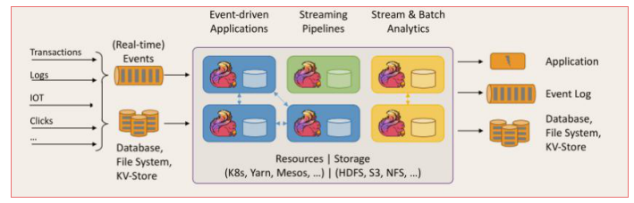

#### 2）Flink的重要特点

* 事件驱动型 Event-driver

  事件驱动型应用是一类具有状态的应用，它从一个或多个事件流提取数据，并根据到来的事件触发计算、状态更新或其他外部动作。比较典型的就是以kafka为代表的消息队列几乎都是事件驱动型应用。

  与之不同的就是sparkStreaming微批次，如图：

  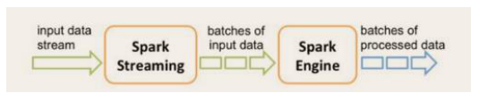

  事件驱动型：

  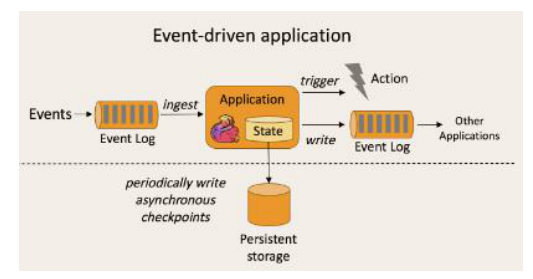

* 流与批的世界观

  **批处理**的特点是有界、持久、大量，非常适合需要访问全套记录才能完成的计算工作，一般用于离线统计。

  **流处理**的特点是无界、实时，无需针对整个数据集执行操作，而是对通过系统的传输的每个数据项执行操作，一般用于实时统计。

  在spark的世界观中，一切都是由批次组成的，离线数据是一个大批次，而实时数据是由一个一个无限小的小批次组成的。

  在Flink的世界观中，一切都是由流组成的，离线数据是有限的流，实时数据是一个没有界限的流，这就是所谓的有界流和无界流。

  无界数据流：无界数据流有一个开始但是没有结束，它们不会在生成时终止并
  提供数据，必须连续处理无界流，也就是说必须在获取后立即处理 event。对于无界
  数据流我们无法等待所有数据都到达，因为输入是无界的，并且在任何时间点都不
  会完成。处理无界数据通常要求以特定顺序（例如事件发生的顺序）获取 event，以
  便能够推断结果完整性。
  有界数据流：有界数据流有明确定义的开始和结束，可以在执行任何计算之前
  通过获取所有数据来处理有界流，处理有界流不需要有序获取，因为可以始终对有
  界数据集进行排序，有界流的处理也称为批处理。

  

* 分层api

  

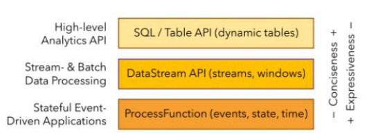

**快速上手**

~~~scala
object StreamWordCount{
  def main(args: Array[String]): Unit = {
    val params: ParameterTool = ParameterTool.fromArgs(args)
    val host: String = params.get("host")
    val port: Int = params.getInt("port")

    //创建流出具环境
    val env: StreamExecutionEnvironment = StreamExecutionEnvironment.getExecutionEnvironment
    //接收socket文本流
    val textDS: DataStream[String] = env.socketTextStream(host, port)
    val dataStream: DataStream[(String, Int)] = textDS.flatMap(_.split("\\s")).filter(_.nonEmpty).map((_, 1)).keyBy(0).sum(1)
    dataStream.print.setParallelism(1)
    env.execute("socket stream word count")

  }
}

object WordCount {
  def main(args: Array[String]): Unit = {
    //创建执行环境
    val env: ExecutionEnvironment = ExecutionEnvironment.getExecutionEnvironment

    //从文件中读取数据
    val inputPath = "data/hello.txt"
    val inputDS: DataSet[String] = env.readTextFile(inputPath)

    //分词之后，对单词进行groupBy分组，然后进行sum聚合
    val wordCountDS = inputDS.flatMap(_.split(" "))
      .map((_, 1))
      .groupBy(0)
      .sum(1)
    wordCountDS.print()

//    env.execute(" word count")
  }
~~~

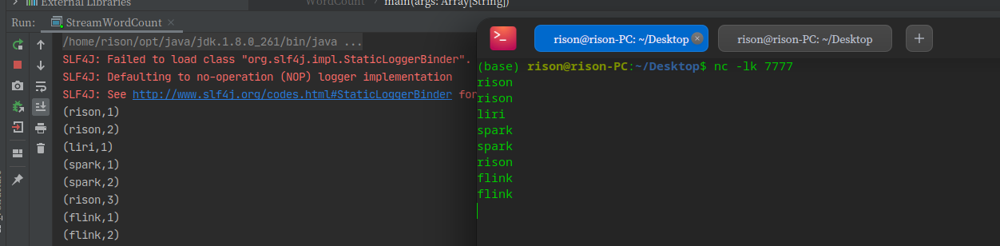

### Flink运行架构

#### 1）运行架构

Flink运行时架构只要包含四个不同的组件，他们会在流处理应用程序协同工作：

作业管理器（JobMananger）

资源管理器（ResouceManager）

任务管理器（TaskManager）

分发器（dispatcher）

因为Flink是用Java和scala实现的，所以所有的组件都会运行在JVM上，每个组件职责如下：

* 作业管理器（JobMananger）

  控制一个app执行的主进程，也就说，每个应用程序都会被一个不同的JM所控制执行，JM会先接收到要执行的应用程序，这个应用程序会包括：

  * 作业图（JobGraph）
  * 逻辑数据流程图（logical dataflow graph）

  * 打包了所有的类、库
  * 其他资源的jar包

  JM会把JobGraph转换成一个物层面的数据流图，这个图会被叫做“执行图”，包含了所有可以并发执行的任务。JM会向资源管理器请求执行任务的相关资源，也就是TM上的slot,一旦他获取到足够的资源，就会执行图发到真正运行他们的TM上，而运行的过程，JM会负责所以需要的中央协调操作，比如检查点的协调。

* 资源管理器（ResourceManager）

  主要负责管理任务管理器的插槽（slot）， TaskManager插槽是Flink中定义的处理资源单元。Flink为不同的环境和资源管理工具提供了不同的资源管理器，比如：yarn/mesos/k8s,以及standalone部署。

  当JM申请插槽资源的时候，RM会有空闲的插槽的TM会分配个给JM。如果RM没有足够的插槽来满足JM的请求，他还可以向资源提供平台发起会话，以提供启动TM的进程容器。另外，RM还负责终止空闲的TaskManager，释放计算资源。

* 任务管理器（TaskManager）

  Flink 中的工作进程，通常在Flink中会有多个TaskManager运行。每个TM都包含了一定数量的slot,slot的数量限制了TM能执行任务的数量。

  启动之后，TM会向资源管理器注册他的插槽，收到资源指令后，taskmanager将一个或者多个插槽提供给JM调用。JM就可以向插槽分配任务来执行。在执行功过程中，一个TM可以运行同一个应用程序的TM交换数据。

* 分发器（Dispatcher）

  可以跨作业执行，它为应用提供了Rest接口，当一个应用被提交执行时，分发器就会启动并将会将应用提交给jobmanager，由于REST接口，所以dispatcher可以作为集群的一个http接入点，这样就能够不不受防火墙阻挡。dispatcher也会启动一个webUI ，用来方便地展示和将空作业执行的信息。

  Dispatcher在架构中可能不是必须的，这也取决应用的提交运行方式。
  
  

#### 2）任务提交流程

> Flink的各个组件如何交互协作。

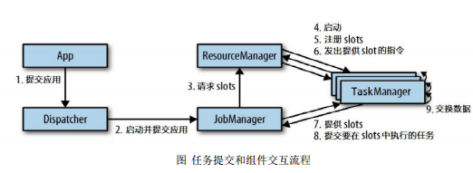

上图是从一个较为高层级的视角，来看应用中各组件的交互协作。如果部署的集群环境
不同（例如 YARN，Mesos，Kubernetes，standalone 等），其中一些步骤可以被省略，或是
有些组件会运行在同一个 JVM 进程中。

> Flink 集群部署到YARN上，提交流程

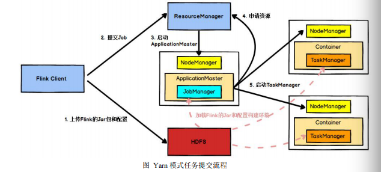

Flink 任 务 提 交 后 ， Client 向 HDFS 上 传 Flink 的 Jar 包 和 配 置 ， 之 后 向 Yarn
ResourceManager 提 交 任 务 ， ResourceManager 分 配 Container 资 源 并 通 知 对 应 的
NodeManager 启动 ApplicationMaster，ApplicationMaster 启动后加载 Flink 的 Jar 包
和配置构建环境，然后启动 JobManager，之后 ApplicationMaster 向 ResourceManager
申 请 资 源 启 动 TaskManager ， ResourceManager 分 配 Container 资 源 后 ， 由
ApplicationMaster 通 知 资 源 所 在 节 点 的 NodeManager 启 动 TaskManager ，
NodeManager 加载 Flink 的 Jar 包和配置构建环境并启动 TaskManager，TaskManager
启动后向 JobManager 发送心跳包，并等待 JobManager 向其分配任务。

#### 3）任务调度原理

* TaskManager 与 slots
* 程序与数据流 DataFlow
* 执行图 executionGraph
* 并行度 Parallelism
* 任务链 operator Chains

### Flink 流处理API

#### 1）Environment

* getExexutionEnvironment
* createLocalEnvironment
* createRemoteEnvironment

* Source

  ~~~scala
  /**
   * @author : Rison 2021/7/6 下午5:50
   *         不同的方读取数据
   */
  object OriginDataType {
  
    private val env: StreamExecutionEnvironment = StreamExecutionEnvironment.getExecutionEnvironment
    //从集合读取数据
    private val dataStream1: DataStream[SensorReading] = env.fromCollection(
      List(
        SensorReading("sensor_1", 1547718199, 35.8),
        SensorReading("sensor_6", 1547718201, 15.4),
        SensorReading("sensor_7", 1547718202, 6.7),
        SensorReading("sensor_10", 1547718205, 38.1)
      )
    )
  
    //从文件读取数据
    private val dataStream2: DataStream[String] = env.readTextFile("/data")
  
    //从kafka读取数据
    /**
     * 引入jar
     * <dependency>
     * <groupId>org.apache.flink</groupId>
     * <artifactId>flink-connector-kafka-0.11_2.12</artifactId>
     * <version>1.10.1</version>
     * </dependency>
     */
  
    private val properties = new Properties()
    properties.setProperty("bootstrap.servers", "localhost:9020")
    properties.setProperty("group.id", "consumer_group")
    properties.setProperty("key.deserializer", "org.apache.kafka.common.serialization.StringDeserializer")
    properties.setProperty("value.deserializer", "org.apache.kafka.common.serialization.StringDeserializer")
    properties.setProperty("auto.offset.reset", "latest")
    private val dataStream3: DataStream[String] = env.addSource(
      new FlinkKafkaConsumer011[String]("sensor", new SimpleStringSchema(), properties)
    )
  
    //自定义source
    private val dataStream4: DataStream[SensorReading] = env.addSource(
      MySenSorSource()
    )
  
  
  }
  
  case class SensorReading(id: String, timestamp: Long, temperature: Double)
  
  case class MySenSorSource() extends SourceFunction[SensorReading] {
    // flag：表示数据源是否还在正常运行
    var running: Boolean = true
  
    override def run(sourceContext: SourceFunction.SourceContext[SensorReading]): Unit = {
      //初始话一个随机数发生器
      val random = new Random()
      var tuples = 1.to(10).map(
        i => {
          ("sensor_" + i, 65 + random.nextGaussian() * 20)
        }
      )
  
      while (running) {
        //更新温度值
        tuples = tuples.map(
          t => (t._1, t._2 + random.nextGaussian())
        )
  
        //当前时间
        val curTime = System.currentTimeMillis()
  
        tuples.foreach(
          t => sourceContext.collect(SensorReading(t._1, curTime, t._2))
        )
        Thread.sleep(100)
      }
    }
  
    override def cancel(): Unit = {
      running = false
    }
  }
  
  ~~~

  

#### 2)   Transform 转换算子

* map

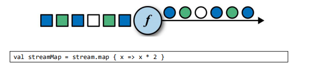

* flatMap

  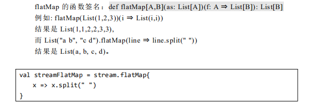

* Filter

  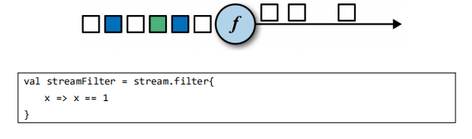

* keyBy

  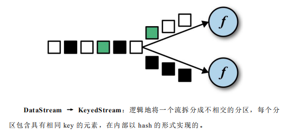

* 滚动聚合算子 Rolling Aggregation

  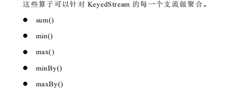

* Reduce

  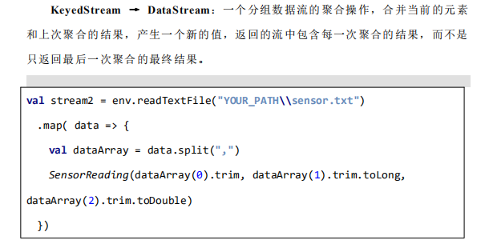

* Split 和 Select

  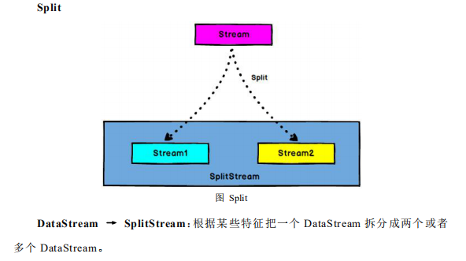

  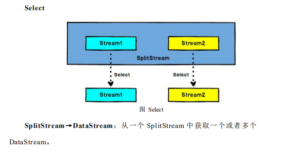

* Connect 和 CoMap

  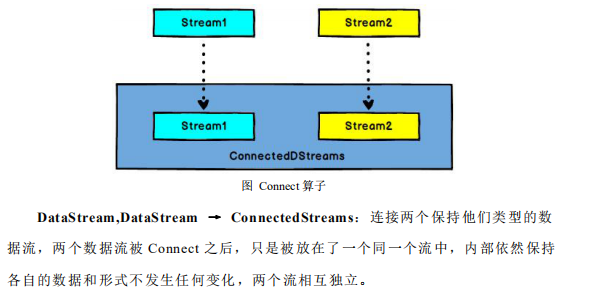

  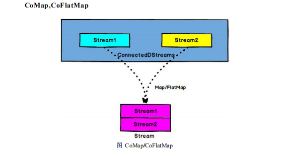

  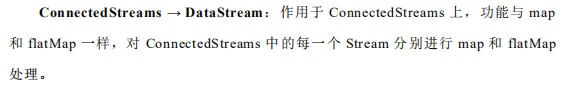

* Union

  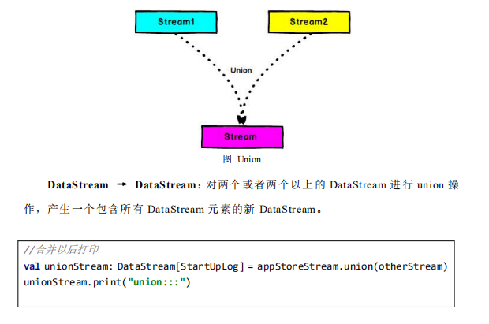

~~~scala
/**
 * @author : Rison 2021/7/6 下午6:27
 *         转换算子
 */
object TransFormFunction {
  def main(args: Array[String]): Unit = {

    val env: StreamExecutionEnvironment = StreamExecutionEnvironment.getExecutionEnvironment

    val dataStream: DataStream[String] = env.readTextFile("data/hello.txt")
    //map
    dataStream.map(
      data => {
        data.toInt * 2
      }
    )

    //flatMap
    /**
     * flatMap 的函数签名：def flatMap[A,B](as: List[A])(f: A ⇒ List[B]): List[B]
     * 例如: flatMap(List(1,2,3))(i ⇒ List(i,i))
     * 结果是 List(1,1,2,2,3,3), 而 List("a b", "c d").flatMap(line ⇒ line.split(" "))
     * 结果是 List(a, b, c, d)。
     */
    dataStream.flatMap(
      data => {
        data.split(" ")
      }
    )

    // Filter
    dataStream.filter(
      data => {
        data.toInt == 1
      }
    )

    //keyBy
    /**
     * DataStream → KeyedStream：逻辑地将一个流拆分成不相交的分区，每个分
     * 区包含具有相同 key 的元素，在内部以 hash 的形式实现的。
     */

    //滚动聚合算子 Rolling Aggregation
    /**
     * 这些算子可以针对 KeyedStream 的每一个支流做聚合。
     *  sum()
     *  min()
     *  max()
     *  minBy()
     *  maxBy()
     */

    // reduce
    /**
     * KeyedStream → DataStream：一个分组数据流的聚合操作，合并当前的元素
     * 和上次聚合的结果，产生一个新的值，返回的流中包含每一次聚合的结果，而不是
     * 只返回最后一次聚合的最终结果
     */

    dataStream.map(
      data => {
        val strings: Array[String] = data.split(",")
        (data(0).toLong, data(1).toInt, data(1).toInt)
      }
    )
      .keyBy(0)
      .reduce(
        (x, y) => {
          (x._1, x._2, x._3 + y._3)
        }
      )

    //Split 和 Select
    /**
     * Split :
     * DataStream → SplitStream：根据某些特征把一个 DataStream 拆分成两个或者
     * 多个 DataStream。
     *
     * Select ：
     * SplitStream→DataStream：从一个 SplitStream 中获取一个或者多个
     * DataStream。
     */

    val splitDataStream: SplitStream[(Long, Int)] = dataStream
      .map(
        data => {
          val strings: Array[String] = data.split(",")
          (strings(0).toLong, strings(1).toInt)
        }
      )
      .split(
        data => {
          if (data._2 > 30) Seq("high") else Seq("low")
        }
      )

    val high: DataStream[(Long, Int)] = splitDataStream.select("high")
    val low: DataStream[(Long, Int)] = splitDataStream.select("low")
    val all: DataStream[(Long, Int)] = splitDataStream.select("high", "low")

    // Connect 和 CoMap

    /**
     * DataStream,DataStream → ConnectedStreams：连接两个保持他们类型的数
     * 据流，两个数据流被 Connect 之后，只是被放在了一个同一个流中，内部依然保持
     * 各自的数据和形式不发生任何变化，两个流相互独立
     *
     * ConnectedStreams → DataStream：作用于 ConnectedStreams 上，功能与 map
     * 和 flatMap 一样，对 ConnectedStreams 中的每一个 Stream 分别进行 map 和 flatMap
     * 处理
     */

    val connectDataStream: ConnectedStreams[(Long, Int), (Long, Int)] = high.connect(low)

    val coMap: DataStream[((Long, Int), String)] = connectDataStream.map(
      highData => (highData, "high"),
      lowData => (lowData, "low")
    )

    //union
    /**
     * DataStream → DataStream：对两个或者两个以上的 DataStream 进行 union 操
     * 作，产生一个包含所有 DataStream 元素的新 DataStream
     *
     * 1． Union 之前两个流的类型必须是一样，Connect 可以不一样，在之后的 coMap
     * 中再去调整成为一样的。
     * 2. Connect 只能操作两个流，Union 可以操作多个
     */
    val union: DataStream[(Long, Int)] = high.union(low)

  }
}

~~~

#### 3) 支持的数据类型

> Flink 流应用程序处理的是以数据对象表示的事件流。所以在 Flink 内部，我们
> 需要能够处理这些对象。它们需要被序列化和反序列化，以便通过网络传送它们；
> 或者从状态后端、检查点和保存点读取它们。为了有效地做到这一点，Flink 需要明
> 确知道应用程序所处理的数据类型。Flink 使用类型信息的概念来表示数据类型，并
> 为每个数据类型生成特定的序列化器、反序列化器和比较器。
> Flink 还具有一个类型提取系统，该系统分析函数的输入和返回类型，以自动获
> 取类型信息，从而获得序列化器和反序列化器。但是，在某些情况下，例如 lambda
> 函数或泛型类型，需要显式地提供类型信息，才能使应用程序正常工作或提高其性
> 能。

* 基础数据类型

  > Flink 支持所有的 Java 和 Scala 基础数据类型，Int, Double, Long, String, …

  ~~~ scala
  val numbers: DataStream[Long] = env.fromElements(1L, 2L, 3L, 4L)
  numbers.map( n => n + 1 )
  ~~~

* Java 和 Scala元组（Tuples）

  ~~~ scala
  val persons: DataStream[(String, Integer)] = env.fromElements(
  ("Adam", 17),
  ("Sarah", 23) )
  persons.filter(p => p._2 > 18)
  ~~~

  

* Scala样例类（case class）

  ~~~scala
  case class Person(name: String, age: Int)
  val persons: DataStream[Person] = env.fromElements(
  Person("Adam", 17),
  Person("Sarah", 23) )
  persons.filter(p => p.age > 18)
  ~~~

  

* Java简单对象（POJO）

  ~~~scala
  public class Person {
  public String name;
  public int age;
  public Person() {}
  public Person(String name, int age) {
  this.name = name;
  this.age = age;
  }
  }
  DataStream<Person> persons = env.fromElements(
  new Person("Alex", 42),
  new Person("Wendy", 23));
  ~~~

  

* 其他（Array,List,Map,Enum,等等）

  > Flink 对 Java 和 Scala 中的一些特殊目的的类型也都是支持的，比如 Java 的
  > ArrayList，HashMap，Enum 等等

  

#### 4) 实现UDF函数----更细粒度的控制流

* 函数类 Function

  Flink 暴露了所有的UDF函数接口（实现方式为接口或者抽象类）。例如MapFunction/FilterFunction/ProcessFunction等等。

  比如 FilterFunction接口：

  ~~~scala
  **
   * @author : Rison 2021/7/6 下午7:32
   *
   */
  class FilterFilter extends FilterFunction[String]{
    override def filter(t: String): Boolean = {
      t.contains("flink")
    }
  }
  
  object FilterMain{
    def main(args: Array[String]): Unit = {
       val env: StreamExecutionEnvironment = StreamExecutionEnvironment.getExecutionEnvironment
  
      val dataStream: DataStream[String] = env.fromCollection(
        List("spark", "flink")
      )
      //外部函数定义
      dataStream.filter(new FilterFilter).print("外部函数：")
  
      //匿名函数
      dataStream.filter(
        new FilterFunction[String] {
          override def filter(t: String) = {
            t.contains("spark")
          }
        }
      ).print("匿名函数：")
  
      //带参判断
  
      dataStream.filter(
        FilterKey("flink")
      ).print("带参数flink:")
  
      env.execute("Filter main")
    }
  }
  
  case class FilterKey(key: String) extends FilterFunction[String]{
    override def filter(t: String): Boolean = {
      t.contains(key)
    }
  }
  ~~~

  

* 匿名函数 lambda Function

  ~~~scala
  
  /**
   * @author : Rison 2021/7/7 上午8:54
   *  lambada Function instance
   */
  object LambdaFunctionMain {
    def main(args: Array[String]): Unit = {
      val env: StreamExecutionEnvironment = StreamExecutionEnvironment.getExecutionEnvironment
      val dataStream: DataStream[String] = env.fromCollection(
        List("flink", "spark")
      )
      dataStream.filter(_.contains("flink")).print("lambda:")
      env.execute("lambda Function")
    }
  }
  ~~~

  

* 富函数 Rich Function

  **富函数**是DataStream API提供的一个函数类的接口，所有Flink函数类都有其Rich版本，她与常规函数的不同在于，可以获取其运行环境的上下文，并拥有一些生命周期方法，所以实现更复杂的功能。

  * RichMapFunction
  * RichFlatMapFunction
  * RichFilterFunction
  * ...

  Rich Function 有一个生命周期的概念，典型的生命周期方法有：

  * open() 是rich function的初始化方法，当一个算子例如map 或者filter被调用之前open()会被调用。

  * close() 是生命周期中的最后调用的方法，做一些清理操作，比如关闭连接等等。

  * getRuntimeContext() 提供了函数的RuntimeContext的一些信息，比如函数要执行的并行度，任务名字，以及state的状态。

    ~~~ scala
    /**
     * @author : Rison 2021/7/7 上午9:07
     *         RichFunction
     *
     */
    object RichFunctionMain {
      def main(args: Array[String]): Unit = {
        val env: StreamExecutionEnvironment = StreamExecutionEnvironment.getExecutionEnvironment
        env.fromCollection(
          List(2, 2, 10, 11, 12, 14, 16, 17, 20)
        ).flatMap(new MyFlatMap).print()
        env.execute("rich function")
    
      }
    }
    
    class MyFlatMap extends RichFlatMapFunction[Int, (Int, Int)] {
      var subTaskIndex = 0
    
      override def open(parameters: Configuration): Unit = {
        subTaskIndex = getRuntimeContext.getIndexOfThisSubtask
        //以下可以做些初始化操作，比如建立hdfs连接等等
      }
    
      override def flatMap(in: Int, collector: Collector[(Int, Int)]): Unit = {
        if (in % 2 == subTaskIndex) {
          collector.collect((subTaskIndex, in))
        }
      }
    
      override def close(): Unit = {
        //做一些关闭清理操作
      }
    }
    
    ~~~

#### 5) Sink

Flink  没有类似于spark的foreach方法，让用户进行迭代操作，虽有对外的输出操作利用Sink完成，最后通过类似如下方式完成整个任务的输出操作：

~~~~ scala
stream.addSink(new MySink(XXXX))
~~~~

官方提供了一部分的框架Sink，除此之外，都要用户自定义实现sink.

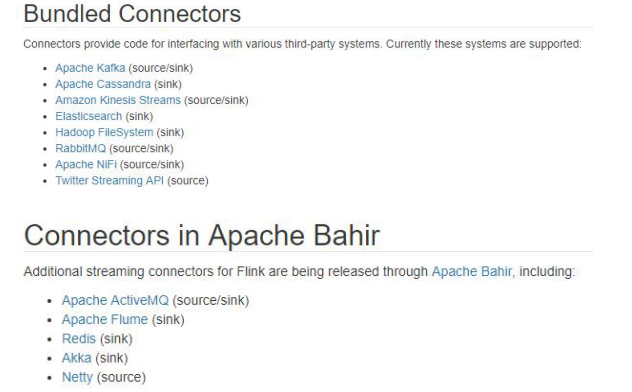

* kafka

  * pom.xml

    ~~~ scala
     <dependency>
                <groupId>org.apache.flink</groupId>
                <artifactId>flink-connector-kafka-0.11_2.12</artifactId>
                <version>1.10.1</version>
     </dependency>
    ~~~

    

  * 代码

    ~~~scala
    /**
     * @author : Rison 2021/7/7 上午9:49
     *         kafka Sink
     */
    object KafkaSinkMain {
      def main(args: Array[String]): Unit = {
        val env: StreamExecutionEnvironment = StreamExecutionEnvironment.getExecutionEnvironment
        env.fromCollection(
          List(
            KafkaDemo("kafka_1", "topic_1"),
            KafkaDemo("kafka_2", "topic_2")
          )
        )
          .map(
            data => {
              data.toString
            }
          )
          .addSink(new FlinkKafkaProducer011[String]("localhost:9092", "test", new SimpleStringSchema[KafkaDemo]()))
        env.execute("kafka sink main")
    
      }
    }
    
    case class KafkaDemo(key: String, topic: String)
    ~~~

    

* redis

  * pom.xml

    ~~~ scala
            <dependency>
                <groupId>org.apache.bahir</groupId>
                <artifactId>flink-connector-redis_2.11</artifactId>
                <version>1.0</version>
            </dependency>
    ~~~

    

  * 代码

    ~~~scala
    /**
     * @author : Rison 2021/7/7 上午10:06
     *         Redis Sink
     */
    object RedisSinkMain {
      def main(args: Array[String]): Unit = {
        val env: StreamExecutionEnvironment = StreamExecutionEnvironment.getExecutionEnvironment
        val redisConf: FlinkJedisPoolConfig = new FlinkJedisPoolConfig.Builder()
          .setHost("192.168.1.215")
          .setPort(6379)
          .setPassword("xxxx")
          .setDatabase(12)
          .build()
        env.fromCollection(
          List(
            RedisDemo("key_1", "value_1"),
            RedisDemo("key_2", "value_2")
          )
        ).addSink(new RedisSink[RedisDemo](redisConf, MyRedisMapper()))
        env.addSource(MyRedisSource("redis:sink:instance")).print()
        env.execute("redis sink")
      }
    }
    
    case class RedisDemo(key: String, value: String)
    
    case class MyRedisMapper() extends RedisMapper[RedisDemo] {
      override def getCommandDescription: RedisCommandDescription = {
        new RedisCommandDescription(RedisCommand.HSET, "redis:sink:instance")
      }
    
      override def getKeyFromData(in: RedisDemo): String = {
        in.key
      }
    
      override def getValueFromData(in: RedisDemo): String = {
        in.value
      }
    }
    
    case class MyRedisSource(key: String) extends RichSourceFunction[RedisDemo] {
      var jedisPool: JedisPool = _
      var jedis: Jedis = _
    
      override def open(parameters: Configuration): Unit = {
        jedisPool = new JedisPool(new JedisPoolConfig(), "192.168.1.215", 6379, 10000, "xxxx", 12, "myRedisClient")
    
      }
    
      override def run(sourceContext: SourceFunction.SourceContext[RedisDemo]): Unit = {
        import scala.collection.JavaConversions._
        jedis = jedisPool.getResource
        val hashMap: util.Map[String, String] = jedis.hgetAll(key)
        hashMap.toList.foreach(
          data => {
            sourceContext.collect(RedisDemo(data._1, data._2))
          }
        )
    
    
      }
    
      override def cancel(): Unit = {
        jedis.close()
        jedisPool.close()
    
      }
    }
    
    ~~~

* ElasticSearch

  * pom.xml

    ~~~scala
            <dependency>
                <groupId>org.apache.flink</groupId>
                <artifactId>flink-connector-elasticsearch6_2.12</artifactId>
                <version>1.10.1</version>
            </dependency>
    ~~~

    

  * 代码

    ~~~scala
    
    /**
     * @author : Rison 2021/7/7 上午11:01
     *         elasticSearch sink
     */
    object ElasticSearchSinkMain {
      def main(args: Array[String]): Unit = {
        val hosts = new util.ArrayList[HttpHost]()
        hosts.add(new HttpHost("localhost", 9200))
        val esSinkBuilder: ElasticsearchSink[ElasticSearchDemo] = new ElasticsearchSink.Builder[ElasticSearchDemo](hosts,
          new ElasticsearchSinkFunction[ElasticSearchDemo] {
            override def process(in: ElasticSearchDemo, runtimeContext: RuntimeContext, requestIndexer: RequestIndexer) = {
              val indexRequest: IndexRequest = Requests
                .indexRequest()
                .index(in.index)
                .`type`(in.`type`)
                .source(in.toString)
              requestIndexer.add(indexRequest)
            }
          }).build()
    
        val env: StreamExecutionEnvironment = StreamExecutionEnvironment.getExecutionEnvironment
        env.fromCollection(
          List(
            ElasticSearchDemo("index_1", "_doc", "value_1"),
            ElasticSearchDemo("index_2", "_doc", "value_1")
          )
        )
          .addSink(esSinkBuilder)
        env.execute("elasticSearch sink")
      }
    }
    
    case class ElasticSearchDemo(index: String, `type`: String, value: String)
    
    ~~~

    

    

* 自定义JDBC Sink

  * pom.xml

    ~~~shell
            <dependency>
                <groupId>mysql</groupId>
                <artifactId>mysql-connector-java</artifactId>
                <version>5.1.48</version>
            </dependency>
    ~~~

  * 代码

    ~~~scala
    
    ~~~

    

