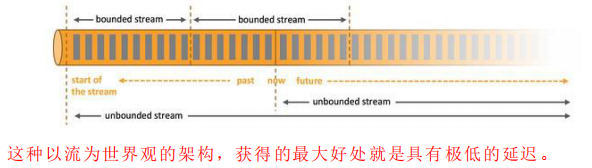

### Flink　简介

* 初识Flink 

  Flink 起源于 Stratosphere 项目，Stratosphere 是在 2010~2014 年由 3 所地处柏林
  的大学和欧洲的一些其他的大学共同进行的研究项目，2014 年 4 月 Stratosphere 的
  代 码 被 复 制 并 捐 赠 给 了 Apache 软 件 基 金 会 ， 参 加 这 个 孵 化 项 目 的 初 始 成 员 是
  Stratosphere 系统的核心开发人员，2014 年 12 月，Flink 一跃成为 Apache 软件基金
  会的顶级项目。
  在德语中，Flink 一词表示快速和灵巧，项目采用一只松鼠的彩色图案作为 logo，
  这不仅是因为松鼠具有快速和灵巧的特点，还因为柏林的松鼠有一种迷人的红棕色，
  而 Flink 的松鼠 logo 拥有可爱的尾巴，尾巴的颜色与 Apache 软件基金会的 logo 颜
  色相呼应，也就是说，这是一只 Apache 风格的松鼠。

  

  Flink 项目的理念是：“**Apache Flink 是为分布式、高性能、随时可用以及准确
  的流处理应用程序打造的开源流处理框架**”。
  Apache Flink 是一个框架和分布式处理引擎，用于对无界和有界数据流进行有
  状态计算。Flink 被设计在所有常见的集群环境中运行，以内存执行速度和任意规模
  来执行计算。

  

* Flink的重要特点

  * 事件驱动型 Event-driver

    事件驱动型应用是一类具有状态的应用，它从一个或多个事件流提取数据，并根据到来的事件触发计算、状态更新或其他外部动作。比较典型的就是以kafka为代表的消息队列几乎都是事件驱动型应用。

    与之不同的就是sparkStreaming微批次，如图：

    

    事件驱动型：

    

  * 流与批的世界观

    **批处理**的特点是有界、持久、大量，非常适合需要访问全套记录才能完成的计算工作，一般用于离线统计。

    **流处理**的特点是无界、实时，无需针对整个数据集执行操作，而是对通过系统的传输的每个数据项执行操作，一般用于实时统计。

    在spark的世界观中，一切都是由批次组成的，离线数据是一个大批次，而实时数据是由一个一个无限小的小批次组成的。

    在Flink的世界观中，一切都是由流组成的，离线数据是有限的流，实时数据是一个没有界限的流，这就是所谓的有界流和无界流。

    无界数据流：无界数据流有一个开始但是没有结束，它们不会在生成时终止并
    提供数据，必须连续处理无界流，也就是说必须在获取后立即处理 event。对于无界
    数据流我们无法等待所有数据都到达，因为输入是无界的，并且在任何时间点都不
    会完成。处理无界数据通常要求以特定顺序（例如事件发生的顺序）获取 event，以
    便能够推断结果完整性。
    有界数据流：有界数据流有明确定义的开始和结束，可以在执行任何计算之前
    通过获取所有数据来处理有界流，处理有界流不需要有序获取，因为可以始终对有
    界数据集进行排序，有界流的处理也称为批处理。

    

  * 分层api

    

  

  

  
  
  
  
  **快速上手**
  
  ~~~scala
  object StreamWordCount{
    def main(args: Array[String]): Unit = {
      val params: ParameterTool = ParameterTool.fromArgs(args)
      val host: String = params.get("host")
      val port: Int = params.getInt("port")
  
      //创建流出具环境
      val env: StreamExecutionEnvironment = StreamExecutionEnvironment.getExecutionEnvironment
      //接收socket文本流
      val textDS: DataStream[String] = env.socketTextStream(host, port)
      val dataStream: DataStream[(String, Int)] = textDS.flatMap(_.split("\\s")).filter(_.nonEmpty).map((_, 1)).keyBy(0).sum(1)
      dataStream.print.setParallelism(1)
      env.execute("socket stream word count")
  
    }
  }
  
  object WordCount {
    def main(args: Array[String]): Unit = {
      //创建执行环境
      val env: ExecutionEnvironment = ExecutionEnvironment.getExecutionEnvironment
  
      //从文件中读取数据
      val inputPath = "data/hello.txt"
      val inputDS: DataSet[String] = env.readTextFile(inputPath)
  
      //分词之后，对单词进行groupBy分组，然后进行sum聚合
      val wordCountDS = inputDS.flatMap(_.split(" "))
        .map((_, 1))
        .groupBy(0)
        .sum(1)
      wordCountDS.print()
  
  //    env.execute(" word count")
    }
  ~~~
  
  

### Flink运行架构

* Flink运行时架构只要包含四个不同的组件，他们会在流处理应用程序协同工作：

  作业管理器（JobMananger）

  资源管理器（ResouceManager）

  任务管理器（TaskManager）

  分发器（dispatcher）

  因为Flink是用Java和scala实现的，所以所有的组件都会运行在JVM上，每个组件职责如下：

  * 作业管理器（JobMananger）

    控制一个app执行的主进程，也就说，每个应用程序都会被一个不同的JM所控制执行，JM会先接收到要执行的应用程序，这个应用程序会包括：

    * 作业图（JobGraph）
    * 逻辑数据流程图（logical dataflow graph）

    * 打包了所有的类、库
    * 其他资源的jar包

    JM会把JobGraph转换成一个物层面的数据流图，这个图会被叫做“执行图”，包含了所有可以并发执行的任务。JM会向资源管理器请求执行任务的相关资源，也就是TM上的slot,一旦他获取到足够的资源，就会执行图发到真正运行他们的TM上，而运行的过程，JM会负责所以需要的中央协调操作，比如检查点的协调。

  * 资源管理器（ResourceManager）

    主要负责管理任务管理器的插槽（slot）， TaskManager插槽是Flink中定义的处理资源单元。Flink为不同的环境和资源管理工具提供了不同的资源管理器，比如：yarn/mesos/k8s,以及standalone部署。

    当JM申请插槽资源的时候，RM会有空闲的插槽的TM会分配个给JM。如果RM没有足够的插槽来满足JM的请求，他还可以向资源提供平台发起会话，以提供启动TM的进程容器。另外，RM还负责终止空闲的TaskManager，释放计算资源。

  * 任务管理器（TaskManager）

    Flink 中的工作进程，通常在Flink中会有多个TaskManager运行。每个TM都包含了一定数量的slot,slot的数量限制了TM能执行任务的数量。

    启动之后，TM会向资源管理器注册他的插槽，收到资源指令后，taskmanager将一个或者多个插槽提供给JM调用。JM就可以向插槽分配任务来执行。在执行功过程中，一个TM可以运行同一个应用程序的TM交换数据。

  * 分发器（Dispatcher）

    可以跨作业执行，它为应用提供了Rest接口，当一个应用被提交执行时，分发器就会启动并将会将应用提交给jobmanager，由于REST接口，所以dispatcher可以作为集群的一个http接入点，这样就能够不不受防火墙阻挡。dispatcher也会启动一个webUI ，用来方便地展示和将空作业执行的信息。

    Dispatcher在架构中可能不是必须的，这也取决应用的提交运行方式。

* 任务提交流程

  > Flink的各个组件如何交互协作。

  

  上图是从一个较为高层级的视角，来看应用中各组件的交互协作。如果部署的集群环境
  不同（例如 YARN，Mesos，Kubernetes，standalone 等），其中一些步骤可以被省略，或是
  有些组件会运行在同一个 JVM 进程中。

  > Flink 集群部署到YARN上，提交流程

  

  Flink 任 务 提 交 后 ， Client 向 HDFS 上 传 Flink 的 Jar 包 和 配 置 ， 之 后 向 Yarn
  ResourceManager 提 交 任 务 ， ResourceManager 分 配 Container 资 源 并 通 知 对 应 的
  NodeManager 启动 ApplicationMaster，ApplicationMaster 启动后加载 Flink 的 Jar 包
  和配置构建环境，然后启动 JobManager，之后 ApplicationMaster 向 ResourceManager
  申 请 资 源 启 动 TaskManager ， ResourceManager 分 配 Container 资 源 后 ， 由
  ApplicationMaster 通 知 资 源 所 在 节 点 的 NodeManager 启 动 TaskManager ，
  NodeManager 加载 Flink 的 Jar 包和配置构建环境并启动 TaskManager，TaskManager
  启动后向 JobManager 发送心跳包，并等待 JobManager 向其分配任务。

* 任务调度原理

  * TaskManager 与 slots
  * 程序与数据流 DataFlow
  * 执行图 executionGraph
  * 并行度 Parallelism
  * 任务链 operator Chains

### Flink 流处理API

* Environment

  * getExexutionEnvironment
  * createLocalEnvironment
  * createRemoteEnvironment

* Source

  ~~~scala
  /**
   * @author : Rison 2021/7/6 下午5:50
   *         不同的方读取数据
   */
  object OriginDataType {
  
    private val env: StreamExecutionEnvironment = StreamExecutionEnvironment.getExecutionEnvironment
    //从集合读取数据
    private val dataStream1: DataStream[SensorReading] = env.fromCollection(
      List(
        SensorReading("sensor_1", 1547718199, 35.8),
        SensorReading("sensor_6", 1547718201, 15.4),
        SensorReading("sensor_7", 1547718202, 6.7),
        SensorReading("sensor_10", 1547718205, 38.1)
      )
    )
  
    //从文件读取数据
    private val dataStream2: DataStream[String] = env.readTextFile("/data")
  
    //从kafka读取数据
    /**
     * 引入jar
     * <dependency>
     * <groupId>org.apache.flink</groupId>
     * <artifactId>flink-connector-kafka-0.11_2.12</artifactId>
     * <version>1.10.1</version>
     * </dependency>
     */
  
    private val properties = new Properties()
    properties.setProperty("bootstrap.servers", "localhost:9020")
    properties.setProperty("group.id", "consumer_group")
    properties.setProperty("key.deserializer", "org.apache.kafka.common.serialization.StringDeserializer")
    properties.setProperty("value.deserializer", "org.apache.kafka.common.serialization.StringDeserializer")
    properties.setProperty("auto.offset.reset", "latest")
    private val dataStream3: DataStream[String] = env.addSource(
      new FlinkKafkaConsumer011[String]("sensor", new SimpleStringSchema(), properties)
    )
  
    //自定义source
    private val dataStream4: DataStream[SensorReading] = env.addSource(
      MySenSorSource()
    )
  
  
  }
  
  case class SensorReading(id: String, timestamp: Long, temperature: Double)
  
  case class MySenSorSource() extends SourceFunction[SensorReading] {
    // flag：表示数据源是否还在正常运行
    var running: Boolean = true
  
    override def run(sourceContext: SourceFunction.SourceContext[SensorReading]): Unit = {
      //初始话一个随机数发生器
      val random = new Random()
      var tuples = 1.to(10).map(
        i => {
          ("sensor_" + i, 65 + random.nextGaussian() * 20)
        }
      )
  
      while (running) {
        //更新温度值
        tuples = tuples.map(
          t => (t._1, t._2 + random.nextGaussian())
        )
  
        //当前时间
        val curTime = System.currentTimeMillis()
  
        tuples.foreach(
          t => sourceContext.collect(SensorReading(t._1, curTime, t._2))
        )
        Thread.sleep(100)
      }
    }
  
    override def cancel(): Unit = {
      running = false
    }
  }
  
  ~~~

  

* Transform 转换算子

  * map
  * flatMap
  * Filter
  * keyBy
  * 滚动聚合算子 Rolling Aggregation
  * Reduce
  * Split 和 Select
  * Connect 和 CoMap
  * Union

* 支持的数据类型

  * 基础数据类型
  * Java 和 Scala元组（Tuples）
  * Scala样例类（case class）
  * Java简单对象（POJO）
  * 其他（Array,List,Map,Enum,等等）

* 实现UDP函数----更细粒度的控制流

  * 函数类 Function
  * 匿名函数 lambda Function
  * 富函数 Rich Function

